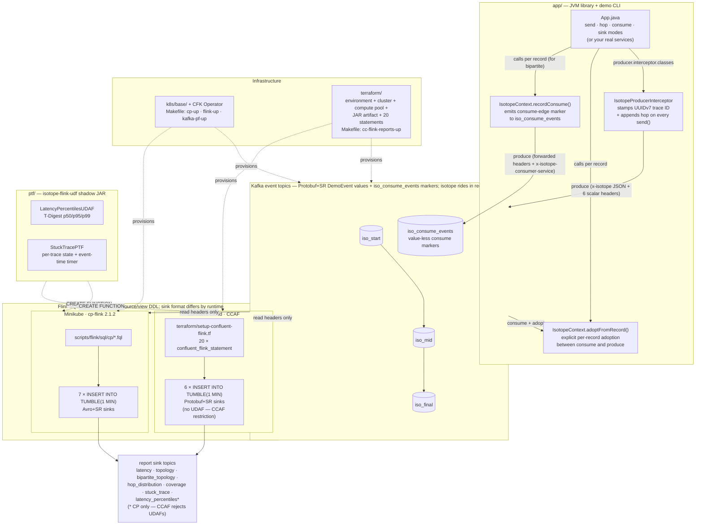

# Confluent Kafka Isotope

An example of using a Kafka **producer interceptor** to tag every message with a tracer — an *isotope* — that carries through every hop of a multi-topic pipeline. Consume-then-produce services adopt the inbound trace into thread-local with one explicit call (`IsotopeContext.adoptFromRecord(record)`) between consume and produce; the next `send()` then appends a fresh hop automatically. For full **bipartite-topology visibility** (services *and* terminal consumers), consumers also call `IsotopeContext.recordConsume(record, service, producer)` to emit a best-effort consume-edge marker to the `iso_consume_events` topic. Apache Flink consumes the tagged records and reports on what the isotopes reveal: **end-to-end latency**, **hop topology** (produce-side and the full **bipartite service↔topic↔service graph**), **drop/duplication rates**, and **pipeline coverage**.

A **portability requirement** runs through this project: the same isotope mechanism must work against both **Confluent Cloud for Apache Flink (CCAF)** (managed) and **Confluent Platform for Apache Flink** (self-managed) — both used here via Table API SQL plus uploaded UDF/PTF JARs (no DataStream code on either side). Three decisions follow from that: tagging happens in a Kafka **producer interceptor** (the one extension point both runtimes share via the broker), the on-wire **header** format is **JSON** (so Flink SQL can read the scalar fields with `CAST(headers[…] AS STRING)` and no UDF), and the optional stateful reports (`LatencyPercentilesUDAF`, `StuckTracePTF`) ship as a single JAR that registers identically on either runtime.

One asymmetry the runtimes don't share: **Flink-native SR-Protobuf**. CCAF supports SR-framed Protobuf as a Flink sink format via its topic catalog; Apache Flink open-source (the CP Flink runtime) ships `avro-confluent` but no SR-Protobuf counterpart. So Flink *report sinks* land on **Avro+SR on CP** and can be **Protobuf+SR on CCAF** — a runtime constraint, not a project preference. The demo *event* topics (next paragraph) are unaffected because they're written by the Kafka producer client, not by Flink.

Message **values** on the demo topics are **SR-framed Protobuf** (`ai.signalroom.kafka.isotope.proto.DemoEvent`) — the standard Confluent value format. The interceptors and reports are agnostic to value format because the isotope rides in headers; the Protobuf choice just gives the integration tests and the demo CLI a typed payload to work with.

---

**Table of Contents**
<!-- toc -->
- [**1.0 How the isotope is carried**](#10-how-the-isotope-is-carried)
- [**2.0 Architecture**](#20-architecture)
- [**3.0 Repo layout**](#30-repo-layout)
- [**4.0 Running**](#40-running)
  - [**4.1. Unit tests (no broker, instant)**](#41-unit-tests-no-broker-instant)
  - [**4.2 Demo CLI — see one trace propagate live**](#42-demo-cli--see-one-trace-propagate-live)
  - [**4.3 Integration tests (live Kafka via Minikube)**](#43-integration-tests-live-kafka-via-minikube)
  - [**4.4 Flink SQL reports on Confluent Platform for Apache Flink (Minikube)**](#44-flink-sql-reports-on-confluent-platform-for-apache-flink-minikube)
    - [**4.4.1 Format-by-domain**](#441-format-by-domain)
  - [**4.5 Flink SQL reports on Confluent Cloud for Apache Flink (CCAF)**](#45-flink-sql-reports-on-confluent-cloud-for-apache-flink-ccaf)
  - [**4.6 Recommended path the first time through**](#46-recommended-path-the-first-time-through)
<!-- tocstop -->

---

## **1.0 How the isotope is carried**

- **Header `x-isotope`** (JSON bytes) carries the full hop history, forwarded by every hop:
  - `t` — 16-byte **UUIDv7** trace ID ([RFC 9562](https://www.rfc-editor.org/rfc/rfc9562)): 48-bit ms timestamp in the high bits + 74 bits random. Stable for the life of the trace,and lexicographic byte order matches creation order — sort trace IDs and you get chronological order for free.
  - `o` — origin timestamp (ms) — same value as the timestamp embedded in the UUIDv7 trace ID; kept as its own field for typed access from Flink SQL without needing to decode the UUID bytes.
  - `s` — origin service name (set once, never reassigned)
  - `h` — ordered list of hops, each `{s: service, t: topic, m: tsMs}`
  - `x` — `true` if the hop list exceeded `MAX_HOPS = 32` and the oldest hop was evicted
- **Six scalar headers** (UTF-8 strings) carry the most-recent-hop view so
  Flink SQL can read them via `CAST(headers['x-isotope-…'] AS STRING)` without parsing the JSON array (no UDF required on either CCAF or CP Flink). See [scripts/flink/README.md](scripts/flink/README.md) for the full header table.

A producer with the isotope interceptor loaded appends one hop on every `send()`. A consume-then-produce service calls `IsotopeContext.adoptFromRecord(record)` between consume and produce so the trace ID and origin survive the hop.

**How the producer interceptor gets invoked.** Application code never calls `onSend` / `onAcknowledgement` directly — the Kafka client invokes them by reflection once two things are in place:

1. **Register the class in producer config.** Put `IsotopeProducerInterceptor.class.getName()` under `interceptor.classes` ([App.java:199](app/src/main/java/ai/signalroom/kafka/isotope/App.java#L199), [App.java:284](app/src/main/java/ai/signalroom/kafka/isotope/App.java#L284), [IsotopeTestHarness.java:96](app/src/integrationTest/java/ai/signalroom/kafka/isotope/IsotopeTestHarness.java#L96)). The `KafkaProducer` constructor instantiates the interceptor and owns its lifecycle.
2. **Call `producer.send(...)` as normal.** Every `send()` triggers `onSend` (caller thread, before serialization) and later `onAcknowledgement` (producer I/O thread, after broker ack or failure).

The exact call sites in `kafka-clients` 4.2.0: `KafkaProducer.send` invokes `interceptors.onSend` ([line 950](https://github.com/apache/kafka/blob/4.2.0/clients/src/main/java/org/apache/kafka/clients/producer/KafkaProducer.java#L950)) and `AppendCallbacks.onCompletion` invokes `interceptors.onAcknowledgement` ([line 1600](https://github.com/apache/kafka/blob/4.2.0/clients/src/main/java/org/apache/kafka/clients/producer/KafkaProducer.java#L1600)). Exceptions thrown by the interceptor are caught and logged by the client's fan-out wrapper — they never break the `send` call.

**Consumer-side adoption is explicit, not an interceptor.** A `ConsumerInterceptor.onConsume` sees a whole batch from `poll()`, but the application processes records one at a time, so a thread-local snapshot from the batch would be ambiguous. Instead, services call `IsotopeContext.adoptFromRecord(record)` per record between consume and produce. The next `send()` then sees that thread-local and appends a new hop. This project ships no consumer interceptor at all — the producer interceptor plus per-record adoption is the entire **produce-side** mechanism.

**Consume-side markers (optional, for bipartite topology).** The produce-side `hops[]` chain encodes the consume edges for intermediate services (svc-B consuming from topic-AB is implied by svc-B's next produced hop), but **terminal consumers** — services that consume but never produce — leave no trace and are invisible to the topology report. To make them visible, consumers call `IsotopeContext.recordConsume(record, service, markerProducer)` between consume and process. The call forwards the inbound record's six scalar `x-isotope-*` headers to a value-less marker record on `iso_consume_events`, adding one new header — `x-isotope-consumer-service` — that names the consumer. The bipartite-topology Flink report unions these markers with the existing produce-side view to emit edges in both directions: `producer → topic` (from `isotope`) and `topic → consumer` (from `consume_events`). Markers are fire-and-forget: a dropped marker leaves a hole in the topology graph but never disrupts the consume/produce pipeline.

## **2.0 Architecture**

A bird's-eye view of the moving parts. The JVM library in [app/](app/) registers a Kafka producer interceptor that stamps the isotope into record headers on every `send()`; consume-then-produce services adopt the inbound trace via an explicit `IsotopeContext.adoptFromRecord(record)` call; records flow through a 3-topic chain; Flink SQL reads only the headers and emits 1-minute aggregate reports. The same source/view DDL deploys to both runtimes — **CP** on Minikube applies `.fql` files under [scripts/flink/sql/cp/](scripts/flink/sql/cp/), and **CCAF** in Confluent Cloud applies inline `confluent_flink_statement` resources under [terraform/](terraform/). The shadow JAR from [ptf/](ptf/) (which powers two of the six reports) registers identically on both. (Kafka is drawn once below for brevity — each runtime provisions its own cluster.)



See [§ 3.0](#30-repo-layout) for the file tree behind each box, and [§ 4.0](#40-running) for the run commands.

## **3.0 Repo layout**

```
app/                                    isotope JVM library + demo CLI + tests
  src/main/proto/ai/signalroom/kafka/isotope/proto/
    demo_event.proto                    DemoEvent message (Protobuf value schema)
  src/main/java/ai/signalroom/kafka/isotope/
    Isotope.java                        POJO + JSON codec + Hop + fromHeaders()
                                        + UUIDv7 helpers (uuidV7Bytes / uuidV7String)
    IsotopeContext.java                 ThreadLocal + adoptFromRecord() +
                                        recordConsume() (emits consume-edge markers)
    IsotopeProducerInterceptor.java     stamps/appends x-isotope + 6 scalar
                                        reporting headers on send()
    App.java                            demo CLI — send / hop / consume / sink modes
  src/test/java/.../                    IsotopeCodecTest, IsotopeContextRecordConsumeTest
                                        (no broker needed)
  src/integrationTest/java/.../         BrokerSmokeIT, ProducerInterceptorIT,
                                        ThreeStageHopPropagationIT, BipartiteTopologyIT,
                                        IsotopeTestHarness — live-broker tests; produce/consume
                                        DemoEvent via SR-framed Protobuf
                                        (need Minikube CP + SR port-forwarded)
ptf/                                    Flink PTF + UDAF shadow JAR (powers 2 of 6 reports)
  src/main/java/ai/signalroom/kafka/isotope/flink/
    LatencyPercentilesUDAF.java         T-Digest p50/p95/p99 aggregate
    StuckTracePTF.java                  per-trace state + event-time timer
    Percentiles.java                    p50/p95/p99 return-type DTO
  src/test/java/.../                    LatencyPercentilesUDAFTest
k8s/base/                               CFK manifests
  confluent-platform-c3++.yaml          Kafka / SR / Connect / ksqlDB / Control Center
  flink-basic-deployment.yaml           cp-flink session cluster + CMF
  flink-rbac.yaml                       RBAC for the cp-flink operator
scripts/
  port-forward-kafka.sh                 localhost:30092 → Kafka, localhost:8081 → SR
  port-forward-taskmanager.sh           Flink TaskManager web UI forward
  deploy-cp-flink-reports.sh            builds shadow JAR + applies sql/cp/*.fql to
                                        the cp-flink session cluster
  deploy-cc-flink-reports.sh            builds shadow JAR + wraps `terraform apply`
                                        for the CCAF path
  cc-cli-env.sh                         pulls Kafka + SR creds from `terraform output`,
                                        builds the JAAS string, exports BOOTSTRAP /
                                        SR_URL / KAFKA_KEY / KAFKA_SECRET / JAAS / ...
  cc-app-run.sh                         thin wrapper around `./gradlew :app:run` that
                                        sources cc-cli-env.sh and injects the six -D flags
  flink/README.md                       Flink SQL reports — runtime split (CP=7 reports/Avro+SR,
                                        CCAF=6 reports/Protobuf+SR), layout, operations
  flink/sql/cp/                         CP Flink SQL: 00_source_table, 01_register_functions,
                                        05_isotope_view, 06_consume_events_view,
                                        05_report_sinks (avro-confluent),
                                        10/20/25/30/40/60/70 INSERT INTO reports, 99_teardown
                                        (CCAF SQL is inlined under terraform/setup-confluent-flink.tf.)
terraform/                              CCAF infrastructure-as-code (`make cc-flink-reports-up`)
  providers.tf                          Confluent provider — cloud key/secret vars
  versions.tf                           required Terraform (>= 1.13) + provider versions
  variables.tf                          confluent_api_key/secret, cloud, region, day_count
  data.tf                               organization lookup + other data sources
  setup-confluent-environment.tf        environment (ESSENTIALS stream-governance package)
  setup-confluent-kafka.tf              Kafka cluster + Kafka API key rotation module
                                        (iac-confluent-api_key_rotation-tf_module)
  setup-confluent-flink.tf              service account + 6 role bindings, compute pool,
                                        artifact upload, SR API key rotation, and 20 inline
                                        `confluent_flink_statement` resources: 4 ALTER TABLE
                                        + 3 VIEW + 6 sink CREATE TABLE + 1 CREATE FUNCTION
                                        (PTF; UDAF skipped — CCAF rejects UDAFs) + 6 INSERT INTO
  outputs.tf                            environment_id, bootstrap, SR URL, rotating
                                        Kafka + SR API key/secret outputs (sensitive)
  terraform.png                         rendered resource graph (embedded in § 4.5)
Makefile                                cp-up / flink-up / kafka-pf-up / flink-reports-up /
                                        cc-flink-reports-up / cc-flink-reports-down / ...
```

## **4.0 Running**

### **4.1. Unit tests (no broker, instant)**

```bash
./gradlew test                       # both subprojects
# or scoped:
./gradlew :app:test                  # IsotopeCodecTest (10) + IsotopeContextRecordConsumeTest (4) — JSON roundtrip, hop eviction, UUIDv7 properties, consume-marker emission (14 tests)
./gradlew :ptf:test                  # LatencyPercentilesUDAFTest — T-Digest accumulator semantics
```

### **4.2 Demo CLI — see one trace propagate live**

The fastest way to watch the isotope mechanic. Requires the cluster to be up and the Kafka + SR forwards running (see step 3 below for the bring-up commands). The CLI has four modes:

| Mode | Args | What it does |
|---|---|---|
| `send`    | `<topic> <service> <payload>`       | Produces one isotope-tagged `DemoEvent` to `<topic>`, then exits. Auto-creates the topic. |
| `hop`     | `<in-topic> <out-topic> <service>`  | Consumes records from `<in-topic>`, adopts the isotope into thread-local, **emits a consume-edge marker to `iso_consume_events` as `<service>`**, then re-produces the same `DemoEvent` to `<out-topic>` (which appends a new hop). Runs until Ctrl-C. |
| `consume` | `<topic> <service>`                 | Terminal-consumer mode for bipartite-topology demos. Subscribes to `<topic>`, **emits a consume-edge marker to `iso_consume_events` as `<service>`**, and pretty-prints the isotope trail. No downstream produce. Runs until Ctrl-C. |
| `sink`    | `<topic>`                           | Passive peek tool — pretty-prints the isotope trail but does NOT emit a consume marker. Use for ad-hoc inspection; use `consume` to make a node visible in the bipartite-topology report. Runs until Ctrl-C. |

**A 4-stage chain (full bipartite graph) in five terminals:**

```bash
# Terminal A — terminal consumer (will print the full 3-hop trail AND emit a
#              consume-edge marker so svc-D shows up in the bipartite report)
./gradlew :app:run --args="consume iso_final svc-D" -q

# Terminal B — middle stage: iso_mid → iso_final as svc-C
./gradlew :app:run --args="hop iso_mid iso_final svc-C" -q

# Terminal C — first stage: iso_start → iso_mid as svc-B
./gradlew :app:run --args="hop iso_start iso_mid svc-B" -q

# Terminal D — kick the chain off (run repeatedly to send more)
./gradlew :app:run --args="send iso_start svc-A 'hello world'" -q
```

Terminal A's output for each record shows the same `trace_id` across all three hops, `origin = svc-A` (never reassigned), and `hops[]` listing `svc-A → svc-B → svc-C` in order with per-hop timestamps. The bipartite-topology report sees all six edges: produce edges `svc-A → iso_start`, `svc-B → iso_mid`, `svc-C → iso_final` and consume edges `iso_start → svc-B`, `iso_mid → svc-C`, `iso_final → svc-D`. Swap `consume` for `sink` if you only want to inspect records without recording the terminal edge. Override endpoints via `-Dkafka.bootstrap=…` / `-Dschema.registry.url=…` if you're not on the default Minikube layout.

### **4.3 Integration tests (live Kafka via Minikube)**

Bring up the local Confluent Platform stack and port-forward Kafka + SR:

```bash
make minikube-start                  # one-time
make cp-up                           # CFK Operator + Kafka/SR/Connect/ksqlDB/C3 (~5 min)
make kafka-pf-up                     # localhost:30092 → Kafka, localhost:8081 → Schema Registry
```

Then run the suite:

```bash
./gradlew :app:integrationTest                                          # every IT below
./gradlew :app:integrationTest --tests '*ProducerInterceptorIT'         # just one
```

Override the endpoints if needed:

```bash
./gradlew :app:integrationTest \
    -PkafkaBootstrap=localhost:30092 \
    -PschemaRegistryUrl=http://localhost:8081
```

Tear down forwards when done:

```bash
make kafka-pf-down
```

The integration tests cover:

| Test | What it verifies |
|---|---|
| `BrokerSmokeIT` | AdminClient can create/list/delete a topic via the NodePort port-forward |
| `ProducerInterceptorIT` | A consumer sees the `x-isotope` JSON header + all 6 scalar reporting headers with the expected origin/hop values, and the Protobuf round-trip preserves `DemoEvent.source` / `payload` |
| `ThreeStageHopPropagationIT` | `svc-A → topic-AB → svc-B → topic-BC → svc-C` produces a stable trace ID, 2-hop trail in send order, and correct scalar headers (origin = `svc-A`, this = `svc-B`, hop count = 2) at the terminal; consume-then-produce hops use `IsotopeContext.adoptFromRecord` to carry the trace forward |
| `BipartiteTopologyIT` | The 4-stage `svc-A → topic-AB → svc-B → topic-BC → svc-C → topic-CD → svc-D` chain emits exactly three consume-edge markers to a per-test markers topic — one per consume edge. Every marker carries the trace ID, forwarded `x-isotope-*` scalars describing the upstream producer, and the new `x-isotope-consumer-service` naming the downstream consumer. Asserts the `(consumer_service, consumed_topic)` set is exactly `{(svc-B, topic-AB), (svc-C, topic-BC), (svc-D, topic-CD)}` |

### **4.4 Flink SQL reports on Confluent Platform for Apache Flink (Minikube)**

The five pure-SQL reports plus the two JAR-backed reports (one PTF, one UDAF) — seven in total — run against a Flink session cluster managed by the Confluent Flink Kubernetes Operator. Same FQL files deploy to Confluent Cloud for Apache Flink — see **[§ 4.5](#45-flink-sql-reports-on-confluent-cloud-for-apache-flink-ccaf)** for that path; this section is the local-Minikube path.

**Bring up Flink:**

```bash
make flink-up                # cert-manager → CFK Flink Operator → CMF → session cluster
                             # (~5 min the first time)
```

**Deploy the reports** — all 7 reports run on the cp-flink session cluster (Flink 2.1.2). Sink topics use Apache Flink's [`avro-confluent`](https://nightlies.apache.org/flink/flink-docs-stable/docs/connectors/table/formats/avro-confluent/) format — SR-framed Avro, auto-registered on first write — so Control Center renders the report rows natively.

```bash
make flink-reports-up
```

`flink-reports-up` builds the PTF/UDAF shadow JAR if missing, copies it into the JobManager pod, pre-creates the 7 sink Kafka topics, then applies the source + view + sink DDL and submits 7 `INSERT INTO` streaming jobs (one per report). On first write to each sink, Apache Flink's `flink-sql-avro-confluent-registry` format registers a fresh Avro schema in SR under subject `<topic>-value`. **Control Center deserializes all 7 report topics natively** — no `.proto` files in the repo for the reports, no hand-installed format jars beyond the one init-container download.

#### **4.4.1 Format-by-domain**

The demo *event* topics (`iso_start`, `iso_mid`, `iso_final`) still ride **Protobuf+SR** via the Java app's `DemoEvent` schema — that's unchanged. The consume-edge marker topic `iso_consume_events` has **null value + scalar headers only** (Flink reads the headers via a `MAP<STRING, BYTES>` virtual column; there's nothing to deserialize). The *report* topics ride **Avro+SR** because cp-flink doesn't ship an SR-integrated Protobuf format and CMF (which does) disallows the UDAFs the percentiles report needs. Events from the app are Protobuf; aggregates from Flink are Avro; consume markers are headers-only. Format by domain — a clean split, not a defect.

### **4.5 Flink SQL reports on Confluent Cloud for Apache Flink (CCAF)**

CCAF parallel of [§ 4.4](#44-flink-sql-reports-on-confluent-platform-for-apache-flink-minikube), driven by Terraform under [terraform/](terraform/). One `make` target spins up a fresh Confluent Cloud environment, Kafka cluster, 4 pre-created event topics (the three demo topics `iso_start` / `iso_mid` / `iso_final` plus the consume-edge marker topic `iso_consume_events`; report sink topics are created on the fly by the Flink `CREATE TABLE` statements — see the comment in [terraform/setup-confluent-kafka.tf](terraform/setup-confluent-kafka.tf) for why pre-creating them via `confluent_kafka_topic` would conflict with CCAF's Topic Catalog auto-import), a Flink compute pool, two rotating service-account API key pairs (one for Kafka, one for Schema Registry), the PTF/UDAF JAR uploaded as a Flink artifact, and 20 long-lived `confluent_flink_statement` resources broken down as **4 ALTER TABLE** (add scalar headers on the event topics) + **3 VIEW** (raw + typed produce + typed consume) + **6 sink CREATE TABLE** + **1 CREATE FUNCTION** (PTF only — the UDAF is intentionally skipped, see the limitation note below) + **6 INSERT INTO** streaming jobs. The Terraform shape mirrors [`apache_flink-kickstarter-ii`](https://github.com/j3-signalroom/apache_flink-kickstarter-ii) — same provider version, same `iac-confluent-api_key_rotation-tf_module`, same DROP-then-CREATE statement pattern.

**Prereqs:**

- [Terraform](https://developer.hashicorp.com/terraform/install) `>= 1.13` installed locally.
- A Confluent Cloud API key (Cloud-level, not cluster-scoped) with permissions to create environments, Kafka clusters, Flink compute pools, service accounts, role bindings, Flink artifacts, and statements. Generate via Console → Settings → Cloud API keys.

**Deploy:**

```bash
export CONFLUENT_API_KEY=...
export CONFLUENT_API_SECRET=...
make cc-flink-reports-up CONFLUENT_API_KEY=$CONFLUENT_API_KEY CONFLUENT_API_SECRET=$CONFLUENT_API_SECRET
```


The wrapper script ([scripts/deploy-cc-flink-reports.sh](scripts/deploy-cc-flink-reports.sh)) builds the PTF/UDAF shadow JAR if missing, then runs `terraform apply -auto-approve` in [terraform/](terraform/). First-run takes ~6–8 minutes (Kafka cluster provisioning dominates). Re-applies are idempotent — `CREATE … IF NOT EXISTS` plus `lifecycle { ignore_changes = [compute_pool] }` on every statement.

**What gets created** (see [terraform/setup-confluent-flink.tf](terraform/setup-confluent-flink.tf) for the full graph):

| Resource | Name | Notes |
|---|---|---|
| `confluent_environment` | `confluent-kafka-isotope` | ESSENTIALS stream-governance package |
| `confluent_kafka_cluster` | `kafka-isotope` | Standard, single-zone, AWS us-east-1 by default |
| `confluent_kafka_topic` × 4 | `iso_{start,mid,final}` + `iso_consume_events` | Only the event topics + the consume-marker topic are pre-created. The 6 `isotope_report_*_1m` sink topics are created on first deploy by their `CREATE TABLE` statement (CCAF's Topic Catalog auto-imports any pre-existing topic as `(key BYTES, val BYTES)`, which would silently no-op the typed `CREATE TABLE`). `terraform destroy` cleans them up via the environment cascade. |
| `confluent_service_account` + 6 role bindings | `isotope-flink-sql-runner` | FlinkDeveloper (org) + ResourceOwner on topic=\* / transactional-id=\* / group=\* / SR subject=\* + Assigner on the service account |
| `confluent_flink_compute_pool` | `isotope-flink-statement-runner` | 10 CFU; headroom for 6 INSERTs + ad-hoc SELECTs |
| `confluent_flink_artifact` | `isotope-flink-udf` | Uploads `ptf/build/libs/isotope-flink-udf.jar` |
| `confluent_flink_statement` × 20 | (see file) | 4 ALTER TABLE (event-topic scalar headers) + 3 VIEW (raw + typed produce + typed consume) + 6 sink CREATE TABLE + 1 CREATE FUNCTION (PTF only; UDAF skipped) + 6 INSERT INTO |

**Useful outputs:**

```bash
terraform -chdir=terraform output environment_id
terraform -chdir=terraform output kafka_bootstrap_servers
terraform -chdir=terraform output schema_registry_url
terraform -chdir=terraform output -raw kafka_api_key     # sensitive
terraform -chdir=terraform output -raw kafka_api_secret  # sensitive
```

**Format-by-runtime (not -by-domain).** CP's reports land on **Avro+SR** (`'value.format' = 'avro-confluent'` in [scripts/flink/sql/cp/05_report_sinks.fql](scripts/flink/sql/cp/05_report_sinks.fql)). CCAF's reports land on **Protobuf+SR** (`'value.format' = 'proto-registry'` in each sink's WITH clause in [terraform/setup-confluent-flink.tf](terraform/setup-confluent-flink.tf)). The two runtimes' SQL is otherwise unshared: CP's lives hardcoded in [scripts/flink/sql/cp/](scripts/flink/sql/cp/), CCAF's lives inline as `confluent_flink_statement` resources in [terraform/setup-confluent-flink.tf](terraform/setup-confluent-flink.tf).

**CCAF UDAF limitation.** CCAF currently rejects all `CREATE FUNCTION` statements for user-defined aggregate functions ("aggregate functions are not supported"). The `LATENCY_PERCENTILES` UDAF therefore deploys on CP only; the percentile report (`latency_percentiles_flat_1m`) does not exist on CCAF. The other JAR-backed function, `STUCK_TRACE_PTF` (a ProcessTableFunction, not a UDAF), works on both runtimes. The JAR itself is portable — `LatencyPercentilesUDAF` ships with a byte[]-based accumulator and is ready to register when Confluent lifts the restriction. The six CCAF reports are: `latency` (avg/min/max), `topology` (produce-side), `bipartite_topology` (full service↔topic↔service graph), `hop_distribution`, `coverage`, `stuck_trace`.

**Driving traffic — the 4-stage demo against CCAF.** [App.java](app/src/main/java/ai/signalroom/kafka/isotope/App.java) reads four optional `-D` properties (`kafka.security.protocol`, `kafka.sasl.mechanism`, `kafka.sasl.jaas.config`, `schema.registry.basic.auth.user.info`) that default to plaintext-no-auth for Minikube. [scripts/cc-cli-env.sh](scripts/cc-cli-env.sh) pulls the Kafka + Schema-Registry credentials from `terraform output` (both keys are rotated by `module.kafka_api_key_rotation` and `module.sr_api_key_rotation` in [terraform/setup-confluent-kafka.tf](terraform/setup-confluent-kafka.tf)) and builds the JAAS string.

The thin wrapper [scripts/cc-app-run.sh](scripts/cc-app-run.sh) sources the env helper then invokes `./gradlew :app:run` with the six `-D` flags — pass it the same `send` / `hop` / `consume` / `sink` args you'd give App.java:

```bash
# Four terminals (same A/B/C/D order as § 4.2). No manual env exports —
# the wrapper sources cc-cli-env.sh, which pulls everything from terraform.
scripts/cc-app-run.sh consume iso_final svc-D       # A — terminal consumer (emits marker)
scripts/cc-app-run.sh hop iso_mid iso_final svc-C   # B
scripts/cc-app-run.sh hop iso_start iso_mid svc-B   # C
scripts/cc-app-run.sh send iso_start svc-A 'hello'  # D
```

The wrapper hard-fails with a clear message if any of the seven required values is missing, so you'll never silently hand gradle empty `-D` values.

Terminal A prints the same `trace_id` across all three hops, and the CCAF report INSERTs populate as you fire Terminal D — `SELECT * FROM isotope_report_latency_1m`, `SELECT * FROM isotope_report_bipartite_topology_1m`, etc. in the Cloud Console SQL workspace. The bipartite report shows all six edges of the chain (3 produce + 3 consume).

**Sustained traffic — required to see report rows.** The six INSERT INTO jobs aggregate over `TUMBLE(event_time, INTERVAL '1' MINUTE)` windows, and a tumbling window only emits when the watermark advances past `window_end`. A handful of records bursted from Terminal D within a single 1-minute interval will sit in one open window forever (the most-recent record is the watermark, and it never gets older than itself). Spread traffic across **multiple** windows so the watermark crosses each boundary:

```bash
# 30 records spaced 5s apart ≈ 2.5 minutes of event-time → spans 3+ windows
for i in {1..30}; do
  scripts/cc-app-run.sh send iso_start svc-A "burst-$i"
  sleep 5
done
```

Wait ~90 seconds after the *last* record before checking `isotope_report_latency_1m` (and friends) — that's the watermark catching up. The `stuck_trace_alerts_1m` sink only fires for traces that go ≥60s of event time without a fresh hop, so the burst above won't trigger it (every trace gets one record and ends — no stalled in-flight state). To exercise `STUCK_TRACE_PTF`: send a single record to `iso_start` and don't run the `svc-B` / `svc-C` hops, then keep sending unrelated records elsewhere so the watermark advances past the stuck trace's `event_time + 60s`.

**Teardown:**

```bash
make cc-flink-reports-down CONFLUENT_API_KEY=$CONFLUENT_API_KEY CONFLUENT_API_SECRET=$CONFLUENT_API_SECRET
```

Runs `terraform destroy -auto-approve` — deletes every resource above, including the environment itself. Safe to run repeatedly.

### **4.6 Recommended path the first time through**

1. `./gradlew test` — proves the codec + UDAF logic without any cluster.
2. `make cp-up && make kafka-pf-up && ./gradlew :app:integrationTest` — proves the broker + SR + interceptor + Protobuf path end-to-end.
3. The 3-stage demo CLI walkthrough above — visually shows the trace accumulating hops.
4. `make flink-up && make flink-reports-up && make flink-sql` — reports populate as you drive traffic via the demo CLI (see [§ 4.2](#42-demo-cli--see-one-trace-propagate-live)).
5. (Optional) `make cc-flink-reports-up` — the CCAF parallel; see [§ 4.5](#45-flink-sql-reports-on-confluent-cloud-for-apache-flink-ccaf) for prereqs and the SASL-config caveat for the demo CLI.
