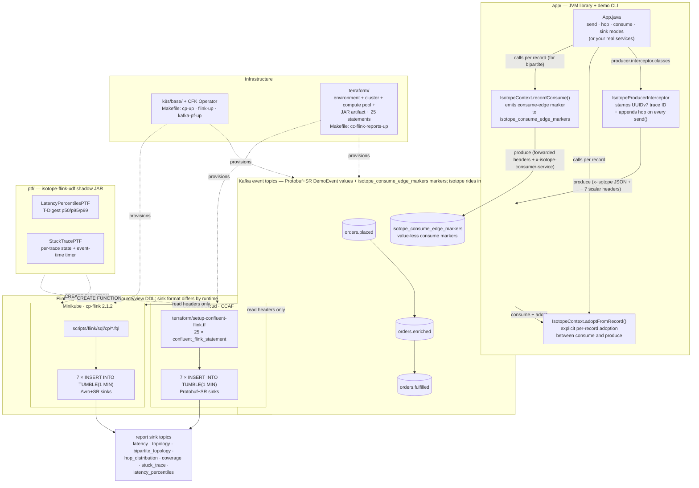
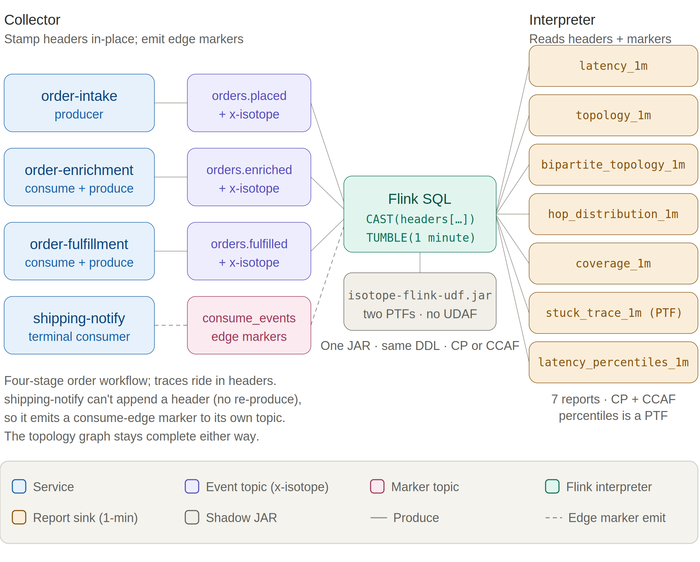

# Confluent Kafka Isotope
`confluent-kafka-isotope` is a reference implementation of an e-commerce order pipeline that uses Kafka Interceptors with Apache Flink to capture and report event tracing data — both in batch and near real time.

Much like isotopes traced through a biochemical pathway, each event carries metadata that allows it to be tracked as it moves through Kafka topics and distributed microservices.

Kafka topics become the connective tissue between services, while Kafka Interceptors quietly transform the pipeline itself into an observable distributed system.

---

**Table of Contents**
<!-- toc -->
- [**1.0 How the isotope is carried**](#10-how-the-isotope-is-carried)
  - [**1.1 How the producer interceptor gets invoked**](#11-how-the-producer-interceptor-gets-invoked)
  - [**1.2 Using the Kafka client interceptor vs explicit library calls**](#12-using-the-kafka-client-interceptor-vs-explicit-library-calls)
  - [**1.3 Why explicit calls for consume-side markers?**](#13-why-explicit-calls-for-consume-side-markers)
  - [**1.4 Why "bipartite"?**](#14-why-bipartite)
- [**2.0 Architecture**](#20-architecture)
- [**3.0 Repo layout**](#30-repo-layout)
- [**4.0 Running**](#40-running)
  - [**4.1. Unit tests (no broker, instant)**](#41-unit-tests-no-broker-instant)
  - [**4.2 Demo CLI — see one trace propagate live**](#42-demo-cli--see-one-trace-propagate-live)
    - [**4.2.1 Full Bipartite Demo**](#421-full-bipartite-demo)
  - [**4.3 Integration tests (live Kafka via Minikube)**](#43-integration-tests-live-kafka-via-minikube)
  - [**4.4 Flink SQL reports on Confluent Platform for Apache Flink (Minikube)**](#44-flink-sql-reports-on-confluent-platform-for-apache-flink-minikube)
  - [**4.5 Flink SQL reports on Confluent Cloud for Apache Flink (CCAF)**](#45-flink-sql-reports-on-confluent-cloud-for-apache-flink-ccaf)
    - [**4.5.1 Provisioning and Deployment commands**](#451-provisioning-and-deployment-commands)
    - [**4.5.2 Format-by-runtime + the percentiles PTF**](#452-format-by-runtime--the-percentiles-ptf)
    - [**4.5.3 Sustained traffic — required to see report rows.**](#453-sustained-traffic--required-to-see-report-rows)
    - [**4.5.4 Teardown**](#454-teardown)
  - [**4.6 Stateless reports via Micrometer → Prometheus/Grafana (optional)**](#46-stateless-reports-via-micrometer--prometheusgrafana-optional)
    - [**4.6.1 Enabling the exporter**](#461-enabling-the-exporter)
    - [**4.6.2 The three reports as PromQL**](#462-the-three-reports-as-promql)
    - [**4.6.3 Consume-side meters**](#463-consume-side-meters)
    - [**4.6.4 What stays in Flink — and two deliberate gaps**](#464-what-stays-in-flink--and-two-deliberate-gaps)
    - [**4.6.5 One-command showcase: Prometheus + Grafana on Minikube**](#465-one-command-showcase-prometheus--grafana-on-minikube)
- [**5.0 Resources**](#50-resources)
<!-- tocstop -->

---

## **1.0 How the isotope is carried**

An isotope is a lightweight tracing artifact attached to Kafka record headers. Like a biochemical isotope used to trace molecules through a metabolic pathway, it allows the journey of a record through an event-driven architecture to be observed and analyzed.

Like many software patterns, Isotope Tracing can be expressed in mathematical terms. This project renders a Kafka pipeline as a **bipartite graph** — services on one vertex set, topics on the other, with edges running both ways between them — so every produce edge, consume edge, and terminal consumer becomes a first-class citizen of a single topology view.

The tracer that makes this possible is the isotope carried in each record header and observed at two points. On the produce side, a Kafka producer interceptor stamps the isotope and appends one hop per `send()` call, creating the graph's produce edges in `hops[]`. On the consume side, `IsotopeContext.recordConsume(record, service, producer)` forwards the isotope to a value-less marker on `isotope_consume_edge_markers`, creating the consume edges. Services that consume and then produce call `IsotopeContext.adoptFromRecord(record)` in between so the trace identity survives each hop.

Apache Flink reads only the headers and reconstructs what the isotopes reveal: **end-to-end latency**, the **complete service→topic→service topology**, **drop and duplication rates**, and **pipeline coverage**.

Viewed through the biochemical analogy, Kafka records are the molecules moving through the system, while isotopes are the labels that make those movements observable. The goal is not to monitor the isotopes themselves, but to understand the behavior of the event-driven architecture they traverse. By following isotopes through topics and services, Apache Flink can reconstruct the pathways records take, measure how long they spend at each stage, detect where they are dropped or duplicated, and reveal the topology of the system as it actually operates.

A point worth affirming up front: **open-source Apache Flink and Confluent Cloud for Apache Flink (CCAF) run this the same way.** The identical isotope mechanism works against both **Confluent Platform for Apache Flink** (self-managed, the open-source Apache Flink runtime) and **CCAF** (managed) — both driven here via Flink SQL plus an uploaded PTF JAR, no DataStream code on either side. Three design choices keep it that way: tagging happens in a Kafka **producer interceptor** (the one extension point both runtimes share via the broker), the on-wire **header** format is **JSON** (so Flink SQL can read the scalar fields with `CAST(headers[…] AS STRING)` and no UDF), and the two stateful reports (`LatencyPercentilesPTF`, `StuckTracePTF`) ship as a single JAR that registers identically on either runtime. Both are `ProcessTableFunction`s — even percentiles, which would naturally be an aggregate function, because CCAF does not support user-defined aggregates currently.

One asymmetry the runtimes don't share: **Flink-native SR-Protobuf**. CCAF supports SR-framed Protobuf as a Flink sink format via its topic catalog; Apache Flink open-source (the CP Flink runtime) ships `avro-confluent` but no SR-Protobuf counterpart. So Flink *report sinks* land on **Avro+SR on CP** and can be **Protobuf+SR on CCAF** — a runtime constraint, not a project preference. The demo *event* topics (next paragraph) are unaffected because they're written by the Kafka producer client, not by Flink.

Message **values** on the demo topics are **SR-framed Protobuf** (`ai.signalroom.kafka.isotope.proto.DemoEvent`) — the standard Confluent value format. The interceptors and reports are agnostic to value format because the isotope rides in headers; the Protobuf choice just gives the integration tests and the demo CLI a typed payload to work with. The **headers** are where the isotope lives, and they have two parts:

- **Header `x-isotope`** (JSON bytes) carries the full hop history, forwarded by every hop:
  - `t` — 16-byte **UUIDv7** trace ID ([RFC 9562](https://www.rfc-editor.org/rfc/rfc9562)): 48-bit ms timestamp in the high bits + 74 bits random. Stable for the life of the trace, and lexicographic byte order matches creation order — sort trace IDs and you get chronological order for free. The random bits come from `ThreadLocalRandom`, not `SecureRandom`: a trace ID is a public observability identifier carried in Kafka headers, so the requirement is collision avoidance, not unpredictability — and `ThreadLocalRandom` delivers that without `SecureRandom`'s per-call cost on every produced record.
  - `o` — origin timestamp (ms) — same value as the timestamp embedded in the UUIDv7 trace ID; kept as its own field for typed access from Flink SQL without needing to decode the UUID bytes.
  - `s` — origin service name (set once, never reassigned)
  - `p` — origin pipeline name (e.g. `orders` vs `location`); like `s`, stamped once at the origin and forwarded unchanged on every hop, so reports can slice traces by which logical pipeline they belong to
  - `h` — ordered list of hops, each `{s: service, t: topic, m: tsMs}`
  - `x` — `true` if the hop list exceeded `MAX_HOPS = 32` and the oldest hop was evicted
- **Seven scalar headers** (UTF-8 strings) carry the most-recent-hop view so
  Flink SQL can read them via `CAST(headers['x-isotope-…'] AS STRING)` without parsing the JSON array (no UDF required on either CCAF or CP Flink). See [scripts/flink/README.md](scripts/flink/README.md) for the full header table.

Example of the Isotope’s two parts (formatted for readability; the actual header is in JSON bytes):
```json
{
	"x-isotope-hop-count": "1",
	"x-isotope": "{\"t\":\"AZ69OS8OeG+9zufGfF2sbw==\",\"o\":1781291101966,\"s\":\"order-intake-service\",\"p\":\"order\",\"h\":[{\"s\":\"order-intake-service\",\"t\":\"orders.placed\",\"m\":1781291101966}],\"x\":false}",
	"x-isotope-trace-id": "019ebd392f0e786fbdcee7c67c5dac6f",
	"x-isotope-this-service": "order-intake-service",
	"x-isotope-origin-service": "order-intake-service",
	"x-isotope-this-topic": "orders.placed",
	"x-isotope-origin-ts": "1781291101966",
	"x-isotope-pipeline": "order"
}
```

A producer with the isotope interceptor loaded appends one hop on every `send()`. A consume-then-produce service calls `IsotopeContext.adoptFromRecord(record)` between consume and produce so the trace ID and origin survive the hop.

### **1.1 How the producer interceptor gets invoked**
Application code never calls `onSend` / `onAcknowledgement` directly — the Kafka client invokes them by reflection once two things are in place:

1. **Register the class in producer config.** Put `IsotopeProducerInterceptor.class.getName()` under `interceptor.classes` ([App.java:199](app/src/main/java/ai/signalroom/kafka/isotope/App.java#L199), [App.java:284](app/src/main/java/ai/signalroom/kafka/isotope/App.java#L284), [IsotopeTestHarness.java:96](app/src/integrationTest/java/ai/signalroom/kafka/isotope/IsotopeTestHarness.java#L96)). The `KafkaProducer` constructor instantiates the interceptor and owns its lifecycle.
2. **Call `producer.send(...)` as normal.** Every `send()` triggers `onSend` (caller thread, before serialization) and later `onAcknowledgement` (producer I/O thread, after broker ack or failure).

The exact call sites in `kafka-clients` 4.2.0: `KafkaProducer.send` invokes `interceptors.onSend` ([line 950](https://github.com/apache/kafka/blob/4.2.0/clients/src/main/java/org/apache/kafka/clients/producer/KafkaProducer.java#L950)) and `AppendCallbacks.onCompletion` invokes `interceptors.onAcknowledgement` ([line 1600](https://github.com/apache/kafka/blob/4.2.0/clients/src/main/java/org/apache/kafka/clients/producer/KafkaProducer.java#L1600)). Exceptions thrown by the interceptor are caught and logged by the client's fan-out wrapper — they never break the `send` call.

### **1.2 Using the Kafka client interceptor vs explicit library calls**
**This project uses one Kafka client interceptor, and it's a `ProducerInterceptor` — not a `ConsumerInterceptor`.** A `ConsumerInterceptor.onConsume` sees a whole batch from `poll()`, but the application processes records one at a time, so a thread-local snapshot from the batch would be ambiguous about which record is being handled. An earlier `IsotopeConsumerInterceptor` was tried and removed for exactly that reason (see [#30](https://github.com/j3-signalroom/confluent-kafka-isotope/issues/30)). The consume side instead runs on **explicit per-record library calls**: services call `IsotopeContext.adoptFromRecord(record)` between consume and produce to carry the trace through a hop (the next `send()` then sees that thread-local and appends a new hop), and `IsotopeContext.recordConsume(record, service, markerProducer)` to emit a consume-edge marker (see the next paragraph). So: **producer interceptor for produce-side stamping; explicit per-record calls for everything consume-side**.

### **1.3 Why explicit calls for consume-side markers?**
**Consume-side markers — the other half of the bipartite graph.** The produce-side `hops[]` chain captures `producer → topic` edges and implicitly captures consume edges for *intermediate* services (svc-B consuming from topic-AB is implied by svc-B's next produced hop), but **terminal consumers** — services that consume but never produce — would otherwise be invisible. The bipartite story closes that gap with one library call: consumers call `IsotopeContext.recordConsume(record, service, markerProducer)` between consume and process, which forwards the inbound record's seven scalar `x-isotope-*` headers to a value-less marker record on `isotope_consume_edge_markers` and adds one new header — `x-isotope-consumer-service` — that names the consumer. The `bipartite_topology` Flink report unions these markers with the produce-side view to emit edges in both directions: `producer → topic` (from `isotope`) and `topic → consumer` (from `consume_events`). Markers are fire-and-forget: a dropped marker leaves a hole in the topology graph but never disrupts the consume/produce pipeline.

### **1.4 Why "bipartite"?**
**Background — why "bipartite"?** The resulting topology report is an example of a [**bipartite graph**](https://en.wikipedia.org/wiki/Bipartite_graph) from graph theory (a sub-field of discrete mathematics). A graph is *bipartite* when its vertices partition into two disjoint sets such that every edge connects a vertex in one set to a vertex in the other — edges never run within a set. Here the two sets are **services** (`svc-A`, `svc-B`, …) and **topics** (`orders.placed`, `orders.enriched`, `orders.fulfilled`, `isotope_consume_edge_markers`); every edge is either a **produce edge** (`service → topic`, from the isotope's `hops[]`) or a **consume edge** (`topic → service`, from the `isotope_consume_edge_markers` markers). Kafka's pub/sub model guarantees the bipartite shape: service  s never connect directly to other services, and topics never connect directly to other topics — every interaction flows through the opposite set. Before consume-side markers existed, only produce edges were captured, so the topology view collapsed into a **unipartite** `service → service → service` chain with topics hidden as edge labels and terminal consumers omitted entirely. With both edge directions now wired, topics become first-class nodes alongside services, and the `bipartite_topology` report renders the full graph — every produce *and* consume edge, in both directions.

## **2.0 Architecture**

A bird's-eye view of the moving parts. The JVM library in [app/](app/) registers a Kafka producer interceptor that stamps the isotope into record headers on every `send()`; consume-then-produce services adopt the inbound trace via an explicit `IsotopeContext.adoptFromRecord(record)` call; records flow through a 3-topic chain; Flink SQL reads only the headers and emits 1-minute aggregate reports. The same source/view DDL deploys to both runtimes — **CP** on Minikube applies `.fql` files under [scripts/flink/sql/cp/](scripts/flink/sql/cp/), and **CCAF** in Confluent Cloud applies inline `confluent_flink_statement` resources under [terraform/](terraform/). The shadow JAR from [ptf/](ptf/) (which powers two of the seven reports) registers identically on both. (Kafka is drawn once below for brevity — each runtime provisions its own cluster.)



See [§ 3.0](#30-repo-layout) for the file tree behind each box, and [§ 4.0](#40-running) for the run commands.

## **3.0 Repo layout**

```
app/                                    isotope JVM library + demo CLI + tests
  src/main/proto/ai/signalroom/kafka/isotope/proto/
    demo_event.proto                    DemoEvent message (Protobuf value schema)
  src/main/java/ai/signalroom/kafka/isotope/
    Isotope.java                        POJO + JSON codec + Hop + fromHeaders()
                                        + UUIDv7 helpers (uuidV7Bytes / uuidV7String)
    IsotopeContext.java                 ThreadLocal + adoptFromRecord() +
                                        recordConsume() (emits consume-edge markers)
    IsotopeProducerInterceptor.java     stamps/appends x-isotope + 7 scalar
                                        reporting headers on send()
    IsotopeMetrics.java                 optional Micrometer/Prometheus exporter
                                        for the 3 stateless reports (§ 4.6)
    App.java                            demo CLI — pipeline-position verbs
                                        (place / enrich / fulfill / ship) + generic
                                        send / hop / consume / sink modes
  src/test/java/.../                    IsotopeCodecTest, IsotopeContextRecordConsumeTest
                                        (no broker needed)
  src/integrationTest/java/.../         BrokerSmokeIT, ProducerInterceptorIT,
                                        ThreeStageHopPropagationIT, BipartiteTopologyIT,
                                        IsotopeTestHarness — live-broker tests; produce/consume
                                        DemoEvent via SR-framed Protobuf
                                        (need Minikube CP + SR port-forwarded)
ptf/                                    Flink PTF shadow JAR (powers 2 of 7 reports)
  src/main/java/ai/signalroom/kafka/isotope/flink/
    LatencyPercentilesPTF.java          T-Digest p50/p95/p99 (PTF: per-window state + timers)
    StuckTracePTF.java                  per-trace state + event-time timer
    TDigests.java                       shared T-Digest (de)serialization
  src/test/java/.../                    TDigestsTest
k8s/base/                               CFK manifests
  confluent-platform-c3++.yaml          Kafka / SR / Connect / ksqlDB / Control Center
  flink-basic-deployment.yaml           cp-flink session cluster + CMF
  flink-rbac.yaml                       RBAC for the cp-flink operator
k8s/monitoring/                         optional metrics showcase (§ 4.6.5) — `make metrics-up`
  00-namespace.yaml                     dedicated 'monitoring' namespace
  10-prometheus.yaml                    Prometheus pod/Service; scrapes host stages
                                        via host.minikube.internal:9410/9411/9412
  20-grafana.yaml                       Grafana pod/Service; auto-provisioned datasource
                                        + 8-panel dashboard for the 6 produce/consume meters
  kustomization.yaml                    `kubectl apply -k k8s/monitoring`
  README.md                             runbook + troubleshooting
scripts/
  port-forward-kafka.sh                 localhost:30092 → Kafka, localhost:8081 → SR
  port-forward-taskmanager.sh           Flink TaskManager web UI forward
  deploy-cp-flink-reports.sh            builds shadow JAR + applies sql/cp/*.fql to
                                        the cp-flink session cluster
  deploy-cc-flink-reports.sh            builds shadow JAR + wraps `terraform apply`
                                        for the CCAF path
  cc-cli-env.sh                         pulls Kafka + SR creds from `terraform output`,
                                        builds the JAAS string, exports BOOTSTRAP /
                                        SR_URL / KAFKA_KEY / KAFKA_SECRET / JAAS / ...
  cc-app-run.sh                         thin wrapper around `./gradlew :app:run` that
                                        sources cc-cli-env.sh and injects the six -D flags
  flink/README.md                       Flink SQL reports — runtime split (CP=7 reports/Avro+SR,
                                        CCAF=7 reports/Protobuf+SR), layout, operations
  flink/sql/cp/                         CP Flink SQL: 00_source_table, 01_register_functions,
                                        05_isotope_view, 06_consume_events_view,
                                        05_report_sinks (avro-confluent),
                                        10/20/25/30/40/60/70 INSERT INTO reports, 99_teardown
                                        (CCAF SQL is inlined under terraform/setup-confluent-flink.tf.)
terraform/                              CCAF infrastructure-as-code (`make cc-flink-reports-up`)
  providers.tf                          Confluent provider — cloud key/secret vars
  versions.tf                           required Terraform (>= 1.13) + provider versions
  variables.tf                          confluent_api_key/secret, cloud, region, day_count
  data.tf                               organization lookup + other data sources
  setup-confluent-environment.tf        environment (ESSENTIALS stream-governance package)
  setup-confluent-kafka.tf              Kafka cluster + Kafka API key rotation module
                                        (iac-confluent-api_key_rotation-tf_module)
  setup-confluent-flink.tf              service account + 6 role bindings, compute pool,
                                        artifact upload, SR API key rotation, and 25 inline
                                        `confluent_flink_statement` resources: 4 ALTER TABLE
                                        + 3 VIEW + 7 sink CREATE TABLE + 2 DROP FUNCTION +
                                        2 CREATE FUNCTION (both PTFs) + 7 INSERT INTO
  outputs.tf                            environment_id, bootstrap, SR URL, rotating
                                        Kafka + SR API key/secret outputs (sensitive)
  terraform.png                         rendered resource graph (embedded in § 4.5)
Makefile                                cp-up / flink-up / kafka-pf-up / flink-reports-up /
                                        cc-flink-reports-up / cc-flink-reports-down /
                                        metrics-up / metrics-down / metrics-delete / ...
```

## **4.0 Running**

Cheapest-first order if you're new: `./gradlew test` (§ 4.1) → local CP via Minikube (§ 4.2–4.4) → CCAF in the cloud (§ 4.5). Skip ahead if you only care about one runtime.

> **Just want the commands?** The full local stack-up sequence (cluster → Kafka → Flink → reports → traffic → teardown) is consolidated in **[docs/runbook-minikube.md](docs/runbook-minikube.md)**.

### **4.1. Unit tests (no broker, instant)**

```bash
./gradlew test                       # both subprojects
# or scoped:
./gradlew :app:test                  # IsotopeCodecTest (10) + IsotopeContextRecordConsumeTest (4) — JSON roundtrip, hop eviction, UUIDv7 properties, consume-marker emission (14 tests)
./gradlew :ptf:test                  # TDigestsTest — T-Digest sketch (de)serialization + accuracy
```

### **4.2 Demo CLI — see one trace propagate live**

The fastest way to watch the isotope mechanic. Requires the cluster to be up and the Kafka + SR forwards running (see step 3 below for the bring-up commands). The CLI has two argument styles — **pipeline-position verbs** that bake in the orders.* topic chain (recommended for the demo) and **generic verbs** that take raw topic + service args (for ad-hoc inspection on any topic):

| Verb | Args | What it does |
|---|---|---|
| `place`   | `[payload]`                         | Produces one isotope-tagged `DemoEvent` to `orders.placed` as `order-intake-service` (default payload: `hello`), then exits. Auto-creates the topic. |
| `enrich`  | —                                   | Consumes from `orders.placed`, adopts the isotope, **emits a consume-edge marker to `isotope_consume_edge_markers` as `order-enrichment-service`**, then re-produces to `orders.enriched`. Runs until Ctrl-C. |
| `fulfill` | —                                   | Same as `enrich` but for `orders.enriched → orders.fulfilled` as `order-fulfillment-service`. Runs until Ctrl-C. |
| `ship`    | —                                   | Terminal consumer for `orders.fulfilled` as `shipping-notification-service`. **Emits a consume-edge marker** so it shows up in the bipartite report; does not re-produce. Runs until Ctrl-C. |
| `send`    | `<topic> <service> <payload>`       | Generic produce. Auto-creates the topic. |
| `hop`     | `<in-topic> <out-topic> <service>`  | Generic consume-then-produce; emits a consume-edge marker. Runs until Ctrl-C. |
| `consume` | `<topic> <service>`                 | Generic terminal-consume; emits a consume-edge marker and pretty-prints the trail. Runs until Ctrl-C. |
| `sink`    | `<topic>`                           | Passive peek — pretty-prints the isotope trail but does NOT emit a consume marker. Use for ad-hoc inspection. Runs until Ctrl-C. |

#### **4.2.1 Full Bipartite Demo**
**A 4-stage chain (full bipartite graph) in four terminals.** Run them in pipeline order — `place` produces, then `enrich` / `fulfill` / `ship` each pick up where the previous stage left off:

```bash
# Terminal A — kick the chain off (run repeatedly to send more)
./gradlew :app:run --args="place 'hello world'" -q

# Terminal B — first hop: orders.placed → orders.enriched
./gradlew :app:run --args="enrich" -q

# Terminal C — middle hop: orders.enriched → orders.fulfilled
./gradlew :app:run --args="fulfill" -q

# Terminal D — terminal consumer (prints the full 3-hop trail AND emits a
#              consume-edge marker so shipping-notification-service shows up
#              in the bipartite report)
./gradlew :app:run --args="ship" -q
```

Terminal D's output for each record shows the same `trace_id` across all three hops, `origin = order-intake-service` (never reassigned), and `hops[]` listing `order-intake-service → order-enrichment-service → order-fulfillment-service` in order with per-hop timestamps. The bipartite-topology report sees all six edges: produce edges `order-intake-service → orders.placed`, `order-enrichment-service → orders.enriched`, `order-fulfillment-service → orders.fulfilled` and consume edges `orders.placed → order-enrichment-service`, `orders.enriched → order-fulfillment-service`, `orders.fulfilled → shipping-notification-service`. Swap `consume` for `sink` if you only want to inspect records without recording the terminal edge. Override endpoints via `-Dkafka.bootstrap=…` / `-Dschema.registry.url=…` if you're not on the default Minikube layout.



### **4.3 Integration tests (live Kafka via Minikube)**

Bring up the local Confluent Platform stack and port-forward Kafka + SR:

```bash
make minikube-start                  # one-time
make cp-up                           # CFK Operator + Kafka/SR/Connect/ksqlDB/C3 (~5 min)
make kafka-pf-up                     # localhost:30092 → Kafka, localhost:8081 → Schema Registry
```

Then run the suite:

```bash
./gradlew :app:integrationTest                                          # every IT below
./gradlew :app:integrationTest --tests '*ProducerInterceptorIT'         # just one
```

Override the endpoints if needed:

```bash
./gradlew :app:integrationTest \
    -PkafkaBootstrap=localhost:30092 \
    -PschemaRegistryUrl=http://localhost:8081
```

Tear down forwards when done:

```bash
make kafka-pf-down
```

The integration tests cover:

| Test | What it verifies |
|---|---|
| `BrokerSmokeIT` | AdminClient can create/list/delete a topic via the NodePort port-forward |
| `ProducerInterceptorIT` | A consumer sees the `x-isotope` JSON header + all 7 scalar reporting headers with the expected origin/hop values, and the Protobuf round-trip preserves `DemoEvent.source` / `payload` |
| `ThreeStageHopPropagationIT` | `order-intake-service → topic-AB → order-enrichment-service → topic-BC → order-fulfillment-service` produces a stable trace ID, 2-hop trail in send order, and correct scalar headers (origin = `order-intake-service`, this = `order-enrichment-service`, hop count = 2) at the terminal; consume-then-produce hops use `IsotopeContext.adoptFromRecord` to carry the trace forward |
| `BipartiteTopologyIT` | The 4-stage `order-intake-service → topic-AB → order-enrichment-service → topic-BC → order-fulfillment-service → topic-CD → shipping-notification-service` chain emits exactly three consume-edge markers to a per-test markers topic — one per consume edge. Every marker carries the trace ID, forwarded `x-isotope-*` scalars describing the upstream producer, and the new `x-isotope-consumer-service` naming the downstream consumer. Asserts the `(consumer_service, consumed_topic)` set is exactly the three pairs of stages 2-4 |

### **4.4 Flink SQL reports on Confluent Platform for Apache Flink (Minikube)**

Seven reports — five pure Flink SQL plus two JAR-backed PTFs — run against a `cp-flink` session cluster (Flink 2.1.2) managed by the Confluent Flink Kubernetes Operator. The same FQL files deploy to Confluent Cloud — see **[§ 4.5](#45-flink-sql-reports-on-confluent-cloud-for-apache-flink-ccaf)** for that path; this section is the local-Minikube one.

**The full bring-up sequence — cluster → Flink → reports → traffic → teardown — is consolidated in [docs/runbook-minikube.md](docs/runbook-minikube.md).** The short version: `make flink-up` then `make flink-reports-up`, then drive traffic across **multiple** 1-minute windows (a single burst sits in one open window forever — the watermark has to cross `window_end` for a tumbling window to emit) and wait ~90s after the last record.

Report sink topics ride **Avro+SR** (`avro-confluent`, auto-registered on first write) so Control Center renders them natively — a deliberate *format-by-domain* split: app events are **Protobuf+SR** (`DemoEvent`), Flink aggregates are **Avro+SR** (cp-flink ships no SR-integrated Protobuf format), and the consume-edge marker topic `isotope_consume_edge_markers` is **null-value / headers-only**. Not a defect — a clean split by domain.

### **4.5 Flink SQL reports on Confluent Cloud for Apache Flink (CCAF)**

CCAF parallel of [§ 4.4](#44-flink-sql-reports-on-confluent-platform-for-apache-flink-minikube), driven by Terraform under [terraform/](terraform/). One `make` target spins up a fresh Confluent Cloud environment, Kafka cluster, 4 pre-created event topics (the three demo topics `orders.placed` / `orders.enriched` / `orders.fulfilled` plus the consume-edge marker topic `isotope_consume_edge_markers`; report sink topics are created on the fly by the Flink `CREATE TABLE` statements — see the comment in [terraform/setup-confluent-kafka.tf](terraform/setup-confluent-kafka.tf) for why pre-creating them via `confluent_kafka_topic` would conflict with CCAF's Topic Catalog auto-import), a Flink compute pool, two rotating service-account API key pairs (one for Kafka, one for Schema Registry), the PTF JAR uploaded as a Flink artifact, and 25 `confluent_flink_statement` resources — 23 long-lived (**4 ALTER TABLE** (add scalar headers on the event topics) + **3 VIEW** (raw + typed produce + typed consume) + **7 sink CREATE TABLE** + **2 CREATE FUNCTION** (both PTFs — `STUCK_TRACE_PTF` and `LATENCY_PERCENTILES`) + **7 INSERT INTO** streaming jobs) plus **2 transient DROP FUNCTION** (the DROP half of the idempotent DROP-then-CREATE for each PTF). The Terraform shape mirrors [`apache_flink-kickstarter-ii`](https://github.com/j3-signalroom/apache_flink-kickstarter-ii) — same provider version, same `iac-confluent-api_key_rotation-tf_module`, same DROP-then-CREATE statement pattern.

#### **4.5.1 Provisioning and Deployment commands**
**Prereqs:**

- [Terraform](https://developer.hashicorp.com/terraform/install) `>= 1.13` installed locally.
- A Confluent Cloud API key (Cloud-level, not cluster-scoped) with permissions to create environments, Kafka clusters, Flink compute pools, service accounts, role bindings, Flink artifacts, and statements. Generate via Console → Settings → Cloud API keys.

**Deploy:**

```bash
export CONFLUENT_API_KEY=...
export CONFLUENT_API_SECRET=...
make cc-flink-reports-up CONFLUENT_API_KEY=$CONFLUENT_API_KEY CONFLUENT_API_SECRET=$CONFLUENT_API_SECRET
```


The wrapper script ([scripts/deploy-cc-flink-reports.sh](scripts/deploy-cc-flink-reports.sh)) builds the PTF shadow JAR if missing, then runs `terraform apply -auto-approve` in [terraform/](terraform/). First-run takes ~6–8 minutes (Kafka cluster provisioning dominates). Re-applies are idempotent — `CREATE … IF NOT EXISTS` plus `lifecycle { ignore_changes = [compute_pool] }` on every statement.

**What gets created** (see [terraform/setup-confluent-flink.tf](terraform/setup-confluent-flink.tf) for the full graph):

| Resource | Name | Notes |
|---|---|---|
| `confluent_environment` | `confluent-kafka-isotope` | ESSENTIALS stream-governance package |
| `confluent_kafka_cluster` | `kafka-isotope` | Standard, single-zone, AWS us-east-1 by default |
| `confluent_kafka_topic` × 4 | `orders.{placed,enriched,fulfilled}` + `isotope_consume_edge_markers` | Only the event topics + the consume-marker topic are pre-created. The 7 `isotope_report_*_1m` sink topics are created on first deploy by their `CREATE TABLE` statement (CCAF's Topic Catalog auto-imports any pre-existing topic as `(key BYTES, val BYTES)`, which would silently no-op the typed `CREATE TABLE`). `terraform destroy` cleans them up via the environment cascade. |
| `confluent_service_account` + 6 role bindings | `isotope-flink-sql-runner` | FlinkDeveloper (org) + ResourceOwner on topic=\* / transactional-id=\* / group=\* / SR subject=\* + Assigner on the service account |
| `confluent_flink_compute_pool` | `isotope-flink-statement-runner` | 10 CFU; headroom for 7 INSERTs + ad-hoc SELECTs |
| `confluent_flink_artifact` | `isotope-flink-udf` | Uploads `ptf/build/libs/isotope-flink-udf.jar` |
| `confluent_flink_statement` × 25 | (see file) | 4 ALTER TABLE (event-topic scalar headers) + 3 VIEW (raw + typed produce + typed consume) + 7 sink CREATE TABLE + 2 DROP FUNCTION + 2 CREATE FUNCTION (both PTFs) + 7 INSERT INTO |

**Useful outputs:**

```bash
terraform -chdir=terraform output environment_id
terraform -chdir=terraform output kafka_bootstrap_servers
terraform -chdir=terraform output schema_registry_url
terraform -chdir=terraform output -raw kafka_api_key     # sensitive
terraform -chdir=terraform output -raw kafka_api_secret  # sensitive
```

#### **4.5.2 Format-by-runtime + the percentiles PTF**
**Format-by-runtime (not -by-domain).** CP's reports land on **Avro+SR** (`'value.format' = 'avro-confluent'` in [scripts/flink/sql/cp/05_report_sinks.fql](scripts/flink/sql/cp/05_report_sinks.fql)). CCAF's reports land on **Protobuf+SR** (`'value.format' = 'proto-registry'` in each sink's WITH clause in [terraform/setup-confluent-flink.tf](terraform/setup-confluent-flink.tf)). The two runtimes' SQL is otherwise unshared: CP's lives hardcoded in [scripts/flink/sql/cp/](scripts/flink/sql/cp/), CCAF's lives inline as `confluent_flink_statement` resources in [terraform/setup-confluent-flink.tf](terraform/setup-confluent-flink.tf).

**Why percentiles is a PTF.** CCAF rejects all `CREATE FUNCTION` statements for user-defined *aggregate* functions ("aggregate functions are not supported"). Percentiles would naturally be an aggregate, so to keep the report portable it's implemented as a `ProcessTableFunction` instead — `LATENCY_PERCENTILES` (class `LatencyPercentilesPTF`) does its own 1-minute tumbling-window aggregation over a T-Digest sketch via per-window state and event-time timers. A PTF has no such restriction, so it registers and runs on **both** runtimes, exactly like `STUCK_TRACE_PTF`. Both runtimes therefore run the same seven reports: `latency` (avg/min/max), `topology` (produce-side), `bipartite_topology` (full service↔topic↔service graph), `hop_distribution`, `coverage`, `stuck_trace`, and `latency_percentiles` (p50/p95/p99).

#### **4.5.3 Sustained traffic — required to see report rows.**
**Driving traffic — the 4-stage demo against CCAF.** [App.java](app/src/main/java/ai/signalroom/kafka/isotope/App.java) reads four optional `-D` properties (`kafka.security.protocol`, `kafka.sasl.mechanism`, `kafka.sasl.jaas.config`, `schema.registry.basic.auth.user.info`) that default to plaintext-no-auth for Minikube. [scripts/cc-cli-env.sh](scripts/cc-cli-env.sh) pulls the Kafka + Schema-Registry credentials from `terraform output` (both keys are rotated by `module.kafka_api_key_rotation` and `module.sr_api_key_rotation` in [terraform/setup-confluent-kafka.tf](terraform/setup-confluent-kafka.tf)) and builds the JAAS string.

The thin wrapper [scripts/cc-app-run.sh](scripts/cc-app-run.sh) sources the env helper then invokes `./gradlew :app:run` with the six `-D` flags. It accepts two argument styles: **pipeline-position verbs** (`place` / `enrich` / `fulfill` / `ship`) that encode the orders.* topic chain so the 4-terminal demo is one word per terminal, and the **generic `send` / `hop` / `consume` / `sink` passthrough** for ad-hoc inspection on topics outside the demo. Run the script with no args for the full verb list.

```bash
# Four terminals in pipeline order — same A/B/C/D order as § 4.2. No manual
# env exports — the wrapper sources cc-cli-env.sh, which pulls everything
# from terraform.
scripts/cc-app-run.sh place 'hello'    # A — kick the chain off
scripts/cc-app-run.sh enrich           # B
scripts/cc-app-run.sh fulfill          # C
scripts/cc-app-run.sh ship             # D — terminal consumer (emits marker)
```

The wrapper hard-fails with a clear message if any of the seven required values is missing, so you'll never silently hand gradle empty `-D` values.

Terminal D prints the same `trace_id` across all three hops, and the CCAF report INSERTs populate as you fire Terminal A — `SELECT * FROM isotope_report_latency_1m`, `SELECT * FROM isotope_report_bipartite_topology_1m`, etc. in the Cloud Console SQL workspace. The bipartite report shows all six edges of the chain (3 produce + 3 consume).

**Sustained traffic — required to see report rows.** The six INSERT INTO jobs aggregate over `TUMBLE(event_time, INTERVAL '1' MINUTE)` windows, and a tumbling window only emits when the watermark advances past `window_end`. A handful of records bursted from Terminal A within a single 1-minute interval will sit in one open window forever (the most-recent record is the watermark, and it never gets older than itself). Spread traffic across **multiple** windows so the watermark crosses each boundary:

```bash
# 30 records spaced 5s apart ≈ 2.5 minutes of event-time → spans 3+ windows
for i in {1..30}; do
  scripts/cc-app-run.sh place "burst-$i"
  sleep 5
done
```

Wait ~90 seconds after the *last* record before checking `isotope_report_latency_1m` (and friends) — that's the watermark catching up. The `stuck_trace_alerts_1m` sink only fires for traces that go ≥60s of event time without a fresh hop, so the burst above won't trigger it (every trace gets one record and ends — no stalled in-flight state). To exercise `STUCK_TRACE_PTF`: send a single record to `orders.placed` and don't run the `order-enrichment-service` / `order-fulfillment-service` hops, then keep sending unrelated records elsewhere so the watermark advances past the stuck trace's `event_time + 60s`.

#### **4.5.4 Teardown**

```bash
make cc-flink-reports-down CONFLUENT_API_KEY=$CONFLUENT_API_KEY CONFLUENT_API_SECRET=$CONFLUENT_API_SECRET
```

Runs `terraform destroy -auto-approve` — deletes every resource above, including the environment itself. Safe to run repeatedly.

### **4.6 Stateless reports via Micrometer → Prometheus/Grafana (optional)**

Is Flink overkill for these reports? **Yes and no** — it's not all about stateless aggregation. Of the seven reports, **three are pure stateless scalar aggregation** keyed on bounded-cardinality dimensions (service / topic / hop_count — never `trace_id`):

- **`latency_1m`** ([10_latency_report.fql](scripts/flink/sql/cp/10_latency_report.fql)) — avg/max latency per `(pipeline, origin_service, this_topic)`.
- **`topology_1m`** ([20_topology_report.fql](scripts/flink/sql/cp/20_topology_report.fql)) — produce-edge record counts.
- **`hop_distribution_1m`** ([30_hop_distribution.fql](scripts/flink/sql/cp/30_hop_distribution.fql)) — records per `hop_count`.

These don't need a stream processor. The [producer interceptor](app/src/main/java/ai/signalroom/kafka/isotope/IsotopeProducerInterceptor.java) already has every value in scope on each `send()`, so it can emit them as **Micrometer** meters and let **Prometheus** do the 1-minute windowing at query time (`rate()` / `increase()`), with **Grafana** on top. The other four reports — `latency_percentiles` (mergeable T-Digest), `coverage`, `bipartite_topology`, `stuck_trace` — are per-`trace_id` *stateful* or *absence-of-event* problems Prometheus can't express, so they **stay in Flink**. This path is **additive and opt-in** (off by default); it doesn't replace the Flink reports — it's the cheaper way to serve the three that are metrics, not stream processing.

Emission lives in one place — [IsotopeMetrics.java](app/src/main/java/ai/signalroom/kafka/isotope/IsotopeMetrics.java) — mirroring how `TDigests` centralizes the sketch contract.

#### **4.6.1 Enabling the exporter**

Pass `-Dmetrics.prometheus.enabled=true` to any long-running stage. **Producing** stages (`hop` / `enrich` / `fulfill`) emit the produce-side meters via the interceptor; **consuming** stages emit the consume-side meters via the marker path (§4.6.3) — `hop` does both (it consumes *and* produces), and the terminal `consume` / `ship` stages emit the consume side alone. The app serves the meters at `GET /metrics` on `metrics.prometheus.port` (default `9404`) via the JDK's built-in HTTP server — no extra runtime.

```bash
# Prereq: 'make kafka-pf-up' is up. Run the enrich stage with metrics exposed:
./gradlew :app:run -Dmetrics.prometheus.enabled=true --args="enrich"
# → metrics on http://localhost:9404/metrics

# In another shell, drive traffic so the meters move (origin produce):
for i in {1..30}; do ./gradlew :app:run --args="place burst-$i" -q; sleep 5; done

# Scrape:
curl -s localhost:9404/metrics | grep isotope_
```

Point a Prometheus scrape job at each stage's `:9404` and the three reports become PromQL queries (no report topics, no Control Center — Grafana instead). Unlike the Flink jobs, there's **no watermark wait**: cumulative counters update on every send and Prometheus windows them at read time.

> **Reading the latency metric — mind the backlog.** `hop` / `consume` use a *random* consumer group with `auto.offset.reset=earliest`, so a fresh stage **replays the whole topic from offset 0**. Latency is `now − origin_ts`, so days-old replayed records report enormous values — e.g. an `isotope_hop_latency_seconds_sum` of ~9,000,000 over 58 records (~43 h average) is just the backlog, not steady-state latency (the Flink `latency_1m` report shows the same, by the same definition). The tell: `_count` exceeds the number of records you just sent. Two ways to see realistic latency: drain the backlog and read `rate(isotope_hop_latency_seconds_sum[1m]) / rate(..._count[1m])` (the windowed rate ignores the stale backlog once it stops growing), or skip the backlog entirely with **`-Disotope.consume.from=latest`** so the stage only consumes records produced after it starts:
>
> ```bash
> ./gradlew :app:run -Dmetrics.prometheus.enabled=true -Disotope.consume.from=latest --args="enrich"
> ```

#### **4.6.2 The three reports as PromQL**

Two meters cover all three reports — a `Timer` whose count doubles as the topology edge count, plus a `Counter` for the hop histogram:

| Report | Meter (Prometheus name) | Labels |
|---|---|---|
| `latency_1m` **+** `topology_1m` | `isotope_hop_latency_seconds_{count,sum,max}` (`Timer`) | `pipeline, origin_service, this_service, this_topic` |
| `hop_distribution_1m` | `isotope_hop_records_total` (`Counter`) | `pipeline, this_topic, hop_count` |

```promql
# latency_1m — avg latency (seconds)
  sum by (pipeline, origin_service, this_topic) (rate(isotope_hop_latency_seconds_sum[1m]))
/ sum by (pipeline, origin_service, this_topic) (rate(isotope_hop_latency_seconds_count[1m]))

# latency_1m — max
max by (pipeline, origin_service, this_topic) (isotope_hop_latency_seconds_max)

# topology_1m — records per produce edge
sum by (pipeline, origin_service, this_service, this_topic) (increase(isotope_hop_latency_seconds_count[1m]))

# hop_distribution_1m — records per hop_count
sum by (pipeline, this_topic, hop_count) (increase(isotope_hop_records_total[1m]))
```

#### **4.6.3 Consume-side meters**

The three meters above all come from the **produce** side — the interceptor on `send()`. The **consume** side adds three more. Two — the edge counter and the time-to-consume latency — are emitted by [`IsotopeContext.recordConsume`](app/src/main/java/ai/signalroom/kafka/isotope/IsotopeContext.java) right beside the consume-edge marker it writes to `isotope_consume_edge_markers`. The third, `isotope.consume.age`, is emitted **once per consumed record on whichever path the consumer takes**: continuing consumers report it from the **adoption path** ([`IsotopeContext.adoptFromRecord(record, service)`](app/src/main/java/ai/signalroom/kafka/isotope/IsotopeContext.java)), and terminal consumers — which never adopt — report it from the **marker path** (`recordConsume`, guarded on `current() == null` so a stage that does both, like `hop`, never double-counts). So age fires on every consuming stage: `hop` via adoption, the terminal `consume` / `ship` stages via the marker. Same gating — no-op unless the exporter is started.

| Signal | Meter (Prometheus name) | Labels |
|---|---|---|
| consume-edge counts (topic→consumer) | `isotope_consume_records_total` (`Counter`) | `pipeline, this_topic, consumer_service` |
| time-to-consume latency (origin→consume) | `isotope_consume_latency_seconds_{count,sum,max}` (`Timer`) | `pipeline, origin_service, consumer_service, this_topic` |
| origin→adoption age (how stale at pickup) | `isotope_consume_age_seconds_{count,sum,max}` (`Timer`) | `pipeline, origin_service, consumer_service, this_topic` |

```promql
# consume edges — records consumed per (topic → consumer) per minute
sum by (pipeline, this_topic, consumer_service) (increase(isotope_consume_records_total[1m]))

# time-to-consume — avg seconds from trace origin to consumption
  sum by (pipeline, consumer_service, this_topic) (rate(isotope_consume_latency_seconds_sum[1m]))
/ sum by (pipeline, consumer_service, this_topic) (rate(isotope_consume_latency_seconds_count[1m]))

# consume age — avg seconds a record had aged by the time a service adopted it
  sum by (pipeline, consumer_service, this_topic) (rate(isotope_consume_age_seconds_sum[1m]))
/ sum by (pipeline, consumer_service, this_topic) (rate(isotope_consume_age_seconds_count[1m]))
```

These are **net-new signals**, not a port of a Flink report. `isotope_consume_records_total` is the *consume half* of the bipartite topology — the topic→consumer edge tallies — and `isotope_consume_latency_seconds_*` is an origin→consume figure no Flink report computes (the Flink `latency_1m` measures origin→**produce**-hop). The **full** `bipartite_topology` report still stays in Flink: stitching produce and consume edges per `trace_id` into one graph is per-trace stateful, which a counter can't do. What you get here is the bounded-cardinality edge *counts* and a time-to-consume distribution — cheap, windowable at read time, and free of the watermark wait.

`isotope_consume_age_seconds_*` measures the **same `now − origin_ts` quantity** as `isotope_consume_latency_seconds_*`, but it's the **universal consume-side age signal** — emitted once on *every* consuming stage, where latency only fires on the marker path. That's the point of having both: query `isotope_consume_age_*` to get consume-lag across **all** consumers (including `hop`-style stages that adopt-and-forward without ever writing a marker), and the timer's `_count` doubles as the per-`(consumer_service, topic)` consume rate. At a terminal consumer the age equals that consumer's latency by definition (same `now − origin_ts`); the two diverge in *coverage*, not value — latency is marker-only, age is everywhere.

> The same **backlog caveat** from §4.6.1 applies: `hop` / `consume` / `ship` use a random consumer group with `auto.offset.reset=earliest`, so a fresh stage replays from offset 0 and both `isotope_consume_latency_seconds_sum` and `isotope_consume_age_seconds_sum` then reflect days-old origins, not steady-state. Read the windowed `rate(...sum[1m]) / rate(...count[1m])`, or start with `-Disotope.consume.from=latest`.

#### **4.6.4 What stays in Flink — and two deliberate gaps**

Moving these out isn't free — two columns the Flink reports carry have **no Prometheus equivalent**, and both are documented in [IsotopeMetrics.java](app/src/main/java/ai/signalroom/kafka/isotope/IsotopeMetrics.java):

- **No `distinct_traces`.** All three SQL reports carry a `COUNT(DISTINCT trace_id)` column. A counter can't dedup, and `trace_id` is unbounded-cardinality so it can't be a label. If you need it, that column stays in Flink (or approximate it with a HyperLogLog sketch).
- **No windowed `min` latency.** A Micrometer `Timer` exposes max but not a per-window min — avg and max port cleanly, min does not.

So the line between "metric" and "Flink job" runs *through* a couple of these reports, not cleanly between them — which is exactly why the move is opt-in rather than a wholesale replacement.

**Why `latency_percentiles_1m` is NOT in this list.** Percentiles *can* be served by Prometheus — but only via a *classic* histogram (`publishPercentileHistogram()` + `histogram_quantile()`), whose accuracy is **bucket-bound, not adaptive**: error is the width of fixed, pre-chosen buckets, so the tail (p99) is only as good as your bucket layout, and covering a range finely means emitting hundreds of `le` series per tag combo. Prometheus's adaptive answer — *native histograms* (exponential buckets, the closest thing to a [T-Digest](https://www.sciencedirect.com/science/article/pii/S2665963820300403)) — isn't emittable through Micrometer yet (experimental, protobuf-only as of late 2024). So the [T-Digest PTF](scripts/flink/sql/cp/70_latency_percentiles_report.fql) wins on tail accuracy **and** scales better: its sketch is bounded (~few KB/key) and mergeable, whereas at production volume a Micrometer percentile-histogram's `le`-bucket cardinality grows with the range you need to resolve. The built-in Flink `PERCENTILE` aggregate (exact, pure SQL) is *also* the wrong call at high volume — it retains every value in the window — so percentiles stay a **T-Digest sketch PTF** on purpose (see that file's header for the full rationale). This is a 3-Micrometer / 4-Flink split, not 4/3.

#### **4.6.5 One-command showcase: Prometheus + Grafana on Minikube**

To *see* these meters instead of `curl`-ing `/metrics`, there's an optional, self-contained stack under [k8s/monitoring/](k8s/monitoring/) — Prometheus + Grafana as Minikube pods, with the datasource and a dashboard (all six produce/consume signals from §4.6.2–4.6.3) **auto-provisioned**, so it opens straight to a populated board with no login.

The pipeline stages run on your **host** via `./gradlew :app:run`, not in-cluster — so Prometheus scrapes back across the Minikube→host bridge `host.minikube.internal`, one host port per stage (`enrich`→9410, `fulfill`→9411, `ship`→9412; edit [k8s/monitoring/10-prometheus.yaml](k8s/monitoring/10-prometheus.yaml) to change the mapping).

```bash
make metrics-up        # deploy, wait, port-forward Prometheus+Grafana, open Grafana

# In separate terminals, run each stage on its mapped port (metrics on):
./gradlew :app:run -Dmetrics.prometheus.enabled=true -Dmetrics.prometheus.port=9410 \
  -Disotope.consume.from=latest --args="enrich"     # fulfill→9411, ship→9412
# …then drive traffic with `place` so the meters move.

make metrics-down      # stop the port-forwards (pods stay up)
make metrics-delete    # tear the whole showcase down
```

Confirm scraping at Prometheus → [Status → Targets](http://localhost:9090/targets) (a target is `DOWN` until you start its stage — expected). Full runbook and troubleshooting: [k8s/monitoring/README.md](k8s/monitoring/README.md).

## **5.0 Resources**
- [Medium Article: Kafka’s quiet observability superpower — Kafka Interceptors](https://thej3.com/kafkas-quiet-observability-superpower-kafka-interceptors-aca88c33867e)
