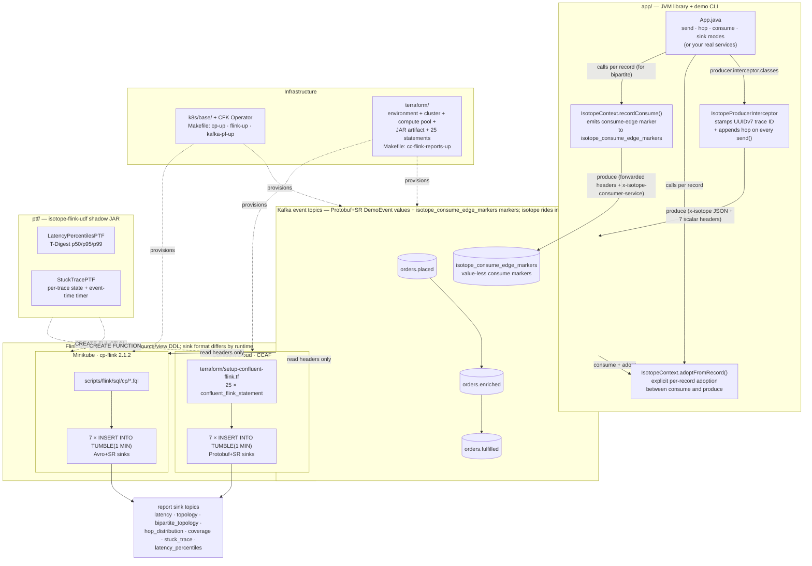
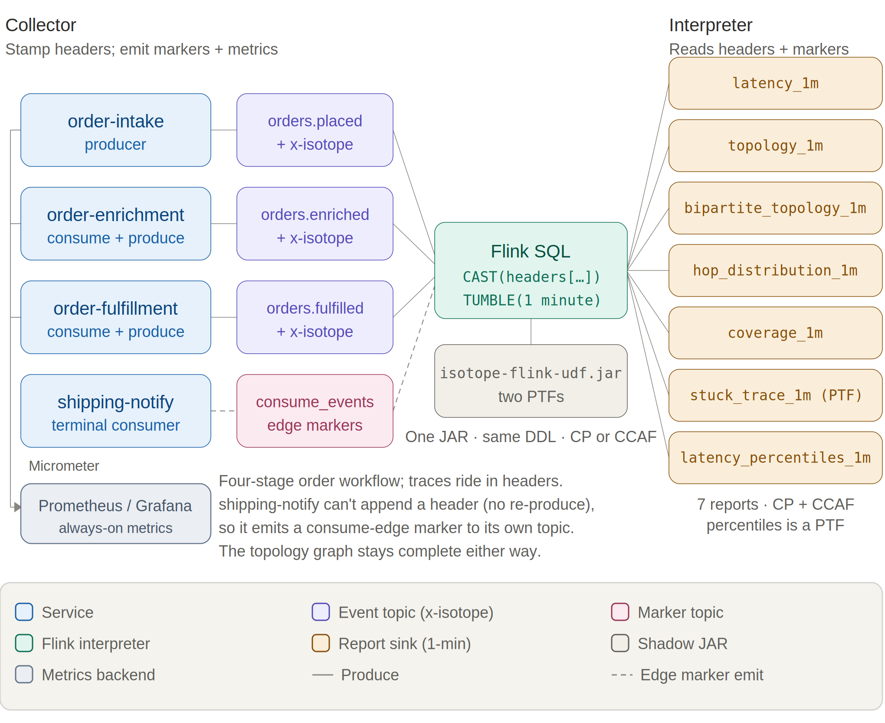
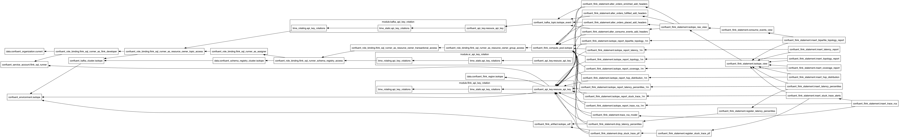

# Confluent Kafka Isotope
`confluent-kafka-isotope` is a reference implementation of an e-commerce order pipeline that uses Kafka Interceptors with Apache Flink to capture and report event tracing data — both in batch and near real time.

Much like isotopes traced through a biochemical pathway, each event carries metadata that allows it to be tracked as it moves through Kafka topics and distributed microservices.

Kafka topics become the connective tissue between services, while Kafka Interceptors quietly transform the pipeline itself into an observable distributed system.

---

**Table of Contents**
<!-- toc -->
- [**1.0 How the isotope is carried**](#10-how-the-isotope-is-carried)
- [**2.0 Architecture**](#20-architecture)
- [**3.0 Repo layout**](#30-repo-layout)
- [**4.0 Running**](#40-running)
  - [**4.1. Unit tests (no broker, instant)**](#41-unit-tests-no-broker-instant)
  - [**4.2 Demo CLI — see one trace propagate live**](#42-demo-cli--see-one-trace-propagate-live)
    - [**4.2.1 Full Bipartite Demo**](#421-full-bipartite-demo)
  - [**4.3 Integration tests (live Kafka via Minikube)**](#43-integration-tests-live-kafka-via-minikube)
  - [**4.4 Flink SQL reports on Confluent Platform for Apache Flink (Minikube)**](#44-flink-sql-reports-on-confluent-platform-for-apache-flink-minikube)
  - [**4.5 Flink SQL reports on Confluent Cloud for Apache Flink (CCAF)**](#45-flink-sql-reports-on-confluent-cloud-for-apache-flink-ccaf)
  - [**4.6 Stateless reports via Micrometer → Prometheus/Grafana (optional)**](#46-stateless-reports-via-micrometer--prometheusgrafana-optional)
- [**5.0 Resources**](#50-resources)
<!-- tocstop -->

---

## **1.0 How the isotope is carried**

An isotope is a lightweight tracing artifact attached to Kafka record headers. Like a biochemical isotope used to trace molecules through a metabolic pathway, it lets the journey of a record through an event-driven architecture be observed and analyzed. This project renders a Kafka pipeline as a **bipartite graph** — services on one vertex set, topics on the other — so every produce edge, consume edge, and terminal consumer becomes a first-class node in a single topology view.

A producer interceptor stamps the isotope and appends one hop per `send()` (the produce edges); consumers call `IsotopeContext.recordConsume(...)` to emit a value-less marker on `isotope_consume_edge_markers` (the consume edges), and consume-then-produce services call `IsotopeContext.adoptFromRecord(...)` so the trace identity survives each hop. Apache Flink reads only the headers and reconstructs end-to-end latency, the full service→topic→service topology, drop/duplication rates, and coverage — identically on **Confluent Platform** (self-managed) and **CCAF** (managed).

> **Full design** — the header layout (`x-isotope` JSON + seven scalar headers with a worked example), how the producer interceptor gets invoked, why the consume side uses explicit calls instead of a `ConsumerInterceptor`, and the bipartite-graph rationale — is in **[docs/design.md](docs/design.md)**.

## **2.0 Architecture**

A bird's-eye view of the moving parts. The JVM library in [app/](app/) registers a Kafka producer interceptor that stamps the isotope into record headers on every `send()`; consume-then-produce services adopt the inbound trace via an explicit `IsotopeContext.adoptFromRecord(record)` call; records flow through a 3-topic chain; Flink SQL reads only the headers and emits 1-minute aggregate reports. The same source/view DDL deploys to both runtimes — **CP** on Minikube applies `.fql` files under [scripts/flink/sql/cp/](scripts/flink/sql/cp/), and **CCAF** in Confluent Cloud applies inline `confluent_flink_statement` resources under [terraform/](terraform/). The shadow JAR from [ptf/](ptf/) (which powers two of the seven reports) registers identically on both. (Kafka is drawn once below for brevity — each runtime provisions its own cluster.)



See [§ 3.0](#30-repo-layout) for the file tree behind each box, and [§ 4.0](#40-running) for the run commands.

## **3.0 Repo layout**

```
app/                                    isotope JVM library + demo CLI + tests
  src/main/proto/ai/signalroom/kafka/isotope/proto/
    demo_event.proto                    DemoEvent message (Protobuf value schema)
  src/main/java/ai/signalroom/kafka/isotope/
    Isotope.java                        POJO + JSON codec + Hop + fromHeaders()
                                        + UUIDv7 helpers (uuidV7Bytes / uuidV7String)
    IsotopeContext.java                 ThreadLocal + adoptFromRecord() +
                                        recordConsume() (emits consume-edge markers)
    IsotopeProducerInterceptor.java     stamps/appends x-isotope + 7 scalar
                                        reporting headers on send()
    IsotopeMetrics.java                 optional Micrometer/Prometheus exporter
                                        for the 3 stateless reports (§ 4.6)
    App.java                            demo CLI — pipeline-position verbs
                                        (place / enrich / fulfill / ship) + generic
                                        send / hop / consume / sink modes
  src/test/java/.../                    IsotopeCodecTest, IsotopeContextRecordConsumeTest
                                        (no broker needed)
  src/integrationTest/java/.../         BrokerSmokeIT, ProducerInterceptorIT,
                                        ThreeStageHopPropagationIT, BipartiteTopologyIT,
                                        IsotopeTestHarness — live-broker tests; produce/consume
                                        DemoEvent via SR-framed Protobuf
                                        (need Minikube CP + SR port-forwarded)
ptf/                                    Flink PTF shadow JAR (powers 2 of 7 reports)
  src/main/java/ai/signalroom/kafka/isotope/flink/
    LatencyPercentilesPTF.java          T-Digest p50/p95/p99 (PTF: per-window state + timers)
    StuckTracePTF.java                  per-trace state + event-time timer
    TDigests.java                       shared T-Digest (de)serialization
  src/test/java/.../                    TDigestsTest
k8s/base/                               CFK manifests
  confluent-platform-c3++.yaml          Kafka / SR / Connect / ksqlDB / Control Center
  flink-basic-deployment.yaml           cp-flink session cluster + CMF
  flink-rbac.yaml                       RBAC for the cp-flink operator
k8s/monitoring/                         optional metrics showcase (§ 4.6) — `make metrics-up`
  00-namespace.yaml                     dedicated 'monitoring' namespace
  10-prometheus.yaml                    Prometheus pod/Service; scrapes host stages
                                        via host.minikube.internal:9410/9411/9412
  20-grafana.yaml                       Grafana pod/Service; auto-provisioned datasource
                                        + 8-panel dashboard for the 6 produce/consume meters
  kustomization.yaml                    `kubectl apply -k k8s/monitoring`
  README.md                             runbook + troubleshooting
scripts/
  port-forward-kafka.sh                 localhost:30092 → Kafka, localhost:8081 → SR
  port-forward-taskmanager.sh           Flink TaskManager web UI forward
  deploy-cp-flink-reports.sh            builds shadow JAR + applies sql/cp/*.fql to
                                        the cp-flink session cluster
  deploy-cc-flink-reports.sh            builds shadow JAR + wraps `terraform apply`
                                        for the CCAF path
  cc-cli-env.sh                         pulls Kafka + SR creds from `terraform output`,
                                        builds the JAAS string, exports BOOTSTRAP /
                                        SR_URL / KAFKA_KEY / KAFKA_SECRET / JAAS / ...
  cc-app-run.sh                         thin wrapper around `./gradlew :app:run` that
                                        sources cc-cli-env.sh and injects the six -D flags
  flink/README.md                       Flink SQL reports — runtime split (CP=7 reports/Avro+SR,
                                        CCAF=7 reports/Protobuf+SR), layout, operations
  flink/sql/cp/                         CP Flink SQL: 00_source_table, 01_register_functions,
                                        05_isotope_view, 06_consume_events_view,
                                        05_report_sinks (avro-confluent),
                                        10/20/25/30/40/60/70 INSERT INTO reports, 99_teardown
                                        (CCAF SQL is inlined under terraform/setup-confluent-flink.tf.)
terraform/                              CCAF infrastructure-as-code (`make cc-flink-reports-up`)
  providers.tf                          Confluent provider — cloud key/secret vars
  versions.tf                           required Terraform (>= 1.13) + provider versions
  variables.tf                          confluent_api_key/secret, cloud, region, day_count
  data.tf                               organization lookup + other data sources
  setup-confluent-environment.tf        environment (ESSENTIALS stream-governance package)
  setup-confluent-kafka.tf              Kafka cluster + Kafka API key rotation module
                                        (iac-confluent-api_key_rotation-tf_module)
  setup-confluent-flink.tf              service account + 6 role bindings, compute pool,
                                        artifact upload, SR API key rotation, and 25 inline
                                        `confluent_flink_statement` resources: 4 ALTER TABLE
                                        + 3 VIEW + 7 sink CREATE TABLE + 2 DROP FUNCTION +
                                        2 CREATE FUNCTION (both PTFs) + 7 INSERT INTO
  outputs.tf                            environment_id, bootstrap, SR URL, rotating
                                        Kafka + SR API key/secret outputs (sensitive)
docs/                                   extracted long-form docs (linked from the README)
  design.md                             how the isotope is carried (§ 1.0 deep-dive)
  runbook-minikube.md                   full CP-on-Minikube run sequence (§ 4.4)
  runbook-ccaf.md                       full CCAF / Terraform run sequence (§ 4.5)
  metrics.md                            Micrometer/Prometheus meter + PromQL reference (§ 4.6)
  terraform.png                         rendered resource graph (embedded in § 4.5)
Makefile                                cp-up / flink-up / kafka-pf-up / flink-reports-up /
                                        cc-flink-reports-up / cc-flink-reports-down /
                                        metrics-up / metrics-down / metrics-delete / ...
```

## **4.0 Running**

Cheapest-first order if you're new: `./gradlew test` (§ 4.1) → local CP via Minikube (§ 4.2–4.4) → CCAF in the cloud (§ 4.5). Skip ahead if you only care about one runtime.

> **Just want the commands?** The full local stack-up sequence (cluster → Kafka → Flink → reports → traffic → teardown) is consolidated in **[docs/runbook-minikube.md](docs/runbook-minikube.md)**.

### **4.1. Unit tests (no broker, instant)**

```bash
./gradlew test                       # both subprojects
# or scoped:
./gradlew :app:test                  # IsotopeCodecTest (10) + IsotopeContextRecordConsumeTest (4) — JSON roundtrip, hop eviction, UUIDv7 properties, consume-marker emission (14 tests)
./gradlew :ptf:test                  # TDigestsTest — T-Digest sketch (de)serialization + accuracy
```

### **4.2 Demo CLI — see one trace propagate live**

The fastest way to watch the isotope mechanic. Requires the cluster to be up and the Kafka + SR forwards running (see step 3 below for the bring-up commands). The CLI has two argument styles — **pipeline-position verbs** that bake in the orders.* topic chain (recommended for the demo) and **generic verbs** that take raw topic + service args (for ad-hoc inspection on any topic):

| Verb | Args | What it does |
|---|---|---|
| `place`   | `[payload]`                         | Produces one isotope-tagged `DemoEvent` to `orders.placed` as `order-intake-service` (default payload: `hello`), then exits. Auto-creates the topic. |
| `enrich`  | —                                   | Consumes from `orders.placed`, adopts the isotope, **emits a consume-edge marker to `isotope_consume_edge_markers` as `order-enrichment-service`**, then re-produces to `orders.enriched`. Runs until Ctrl-C. |
| `fulfill` | —                                   | Same as `enrich` but for `orders.enriched → orders.fulfilled` as `order-fulfillment-service`. Runs until Ctrl-C. |
| `ship`    | —                                   | Terminal consumer for `orders.fulfilled` as `shipping-notification-service`. **Emits a consume-edge marker** so it shows up in the bipartite report; does not re-produce. Runs until Ctrl-C. |
| `send`    | `<topic> <service> <payload>`       | Generic produce. Auto-creates the topic. |
| `hop`     | `<in-topic> <out-topic> <service>`  | Generic consume-then-produce; emits a consume-edge marker. Runs until Ctrl-C. |
| `consume` | `<topic> <service>`                 | Generic terminal-consume; emits a consume-edge marker and pretty-prints the trail. Runs until Ctrl-C. |
| `sink`    | `<topic>`                           | Passive peek — pretty-prints the isotope trail but does NOT emit a consume marker. Use for ad-hoc inspection. Runs until Ctrl-C. |

#### **4.2.1 Full Bipartite Demo**
**A 4-stage chain (full bipartite graph) in four terminals.** Run them in pipeline order — `place` produces, then `enrich` / `fulfill` / `ship` each pick up where the previous stage left off:

```bash
# Terminal A — kick the chain off (run repeatedly to send more)
./gradlew :app:run --args="place 'hello world'" -q

# Terminal B — first hop: orders.placed → orders.enriched
./gradlew :app:run --args="enrich" -q

# Terminal C — middle hop: orders.enriched → orders.fulfilled
./gradlew :app:run --args="fulfill" -q

# Terminal D — terminal consumer (prints the full 3-hop trail AND emits a
#              consume-edge marker so shipping-notification-service shows up
#              in the bipartite report)
./gradlew :app:run --args="ship" -q
```

Terminal D's output for each record shows the same `trace_id` across all three hops, `origin = order-intake-service` (never reassigned), and `hops[]` listing `order-intake-service → order-enrichment-service → order-fulfillment-service` in order with per-hop timestamps. The bipartite-topology report sees all six edges: produce edges `order-intake-service → orders.placed`, `order-enrichment-service → orders.enriched`, `order-fulfillment-service → orders.fulfilled` and consume edges `orders.placed → order-enrichment-service`, `orders.enriched → order-fulfillment-service`, `orders.fulfilled → shipping-notification-service`. Swap `consume` for `sink` if you only want to inspect records without recording the terminal edge. Override endpoints via `-Dkafka.bootstrap=…` / `-Dschema.registry.url=…` if you're not on the default Minikube layout.



### **4.3 Integration tests (live Kafka via Minikube)**

Bring up the local Confluent Platform stack and port-forward Kafka + SR:

```bash
make minikube-start                  # one-time
make cp-up                           # CFK Operator + Kafka/SR/Connect/ksqlDB/C3 (~5 min)
make kafka-pf-up                     # localhost:30092 → Kafka, localhost:8081 → Schema Registry
```

Then run the suite:

```bash
./gradlew :app:integrationTest                                          # every IT below
./gradlew :app:integrationTest --tests '*ProducerInterceptorIT'         # just one
```

Override the endpoints if needed:

```bash
./gradlew :app:integrationTest \
    -PkafkaBootstrap=localhost:30092 \
    -PschemaRegistryUrl=http://localhost:8081
```

Tear down forwards when done:

```bash
make kafka-pf-down
```

The integration tests cover:

| Test | What it verifies |
|---|---|
| `BrokerSmokeIT` | AdminClient can create/list/delete a topic via the NodePort port-forward |
| `ProducerInterceptorIT` | A consumer sees the `x-isotope` JSON header + all 7 scalar reporting headers with the expected origin/hop values, and the Protobuf round-trip preserves `DemoEvent.source` / `payload` |
| `ThreeStageHopPropagationIT` | `order-intake-service → topic-AB → order-enrichment-service → topic-BC → order-fulfillment-service` produces a stable trace ID, 2-hop trail in send order, and correct scalar headers (origin = `order-intake-service`, this = `order-enrichment-service`, hop count = 2) at the terminal; consume-then-produce hops use `IsotopeContext.adoptFromRecord` to carry the trace forward |
| `BipartiteTopologyIT` | The 4-stage `order-intake-service → topic-AB → order-enrichment-service → topic-BC → order-fulfillment-service → topic-CD → shipping-notification-service` chain emits exactly three consume-edge markers to a per-test markers topic — one per consume edge. Every marker carries the trace ID, forwarded `x-isotope-*` scalars describing the upstream producer, and the new `x-isotope-consumer-service` naming the downstream consumer. Asserts the `(consumer_service, consumed_topic)` set is exactly the three pairs of stages 2-4 |

### **4.4 Flink SQL reports on Confluent Platform for Apache Flink (Minikube)**

Seven reports — five pure Flink SQL plus two JAR-backed PTFs — run against a `cp-flink` session cluster (Flink 2.1.2) managed by the Confluent Flink Kubernetes Operator. The same FQL files deploy to Confluent Cloud — see **[§ 4.5](#45-flink-sql-reports-on-confluent-cloud-for-apache-flink-ccaf)** for that path; this section is the local-Minikube one.

**The full bring-up sequence — cluster → Flink → reports → traffic → teardown — is consolidated in [docs/runbook-minikube.md](docs/runbook-minikube.md).** The short version: `make flink-up` then `make flink-reports-up`, then drive traffic across **multiple** 1-minute windows (a single burst sits in one open window forever — the watermark has to cross `window_end` for a tumbling window to emit) and wait ~90s after the last record.

Report sink topics ride **Avro+SR** (`avro-confluent`, auto-registered on first write) so Control Center renders them natively — a deliberate *format-by-domain* split: app events are **Protobuf+SR** (`DemoEvent`), Flink aggregates are **Avro+SR** (cp-flink ships no SR-integrated Protobuf format), and the consume-edge marker topic `isotope_consume_edge_markers` is **null-value / headers-only**. Not a defect — a clean split by domain.

### **4.5 Flink SQL reports on Confluent Cloud for Apache Flink (CCAF)**

The CCAF parallel of [§ 4.4](#44-flink-sql-reports-on-confluent-platform-for-apache-flink-minikube), driven by Terraform under [terraform/](terraform/) — no local cluster. One `make` target spins up a fresh Confluent Cloud environment, Kafka cluster, compute pool, two rotating service-account API key pairs (Kafka + Schema Registry), the uploaded PTF JAR, and 25 `confluent_flink_statement` resources (4 ALTER TABLE + 3 VIEW + 7 sink CREATE TABLE + 2 CREATE FUNCTION + 7 INSERT INTO, plus 2 transient DROP FUNCTION). The shape mirrors [`apache_flink-kickstarter-ii`](https://github.com/j3-signalroom/apache_flink-kickstarter-ii) — same provider version and `iac-confluent-api_key_rotation-tf_module`.



**The full provision → deploy → traffic → teardown sequence is consolidated in [docs/runbook-ccaf.md](docs/runbook-ccaf.md).** The short version: `export` a Cloud-level Confluent Cloud API key, `make cc-flink-reports-up` (~6–8 min first run; idempotent re-applies), drive traffic with `scripts/cc-app-run.sh place|enrich|fulfill|ship` across **multiple** 1-minute windows (a single burst sits in one open window forever, and you wait ~90s after the last record), then `make cc-flink-reports-down` to `terraform destroy` the whole environment.

Two CCAF-specific design points worth keeping in the README:

**Format-by-runtime (not -by-domain).** CP's reports land on **Avro+SR** (`'value.format' = 'avro-confluent'` in [scripts/flink/sql/cp/05_report_sinks.fql](scripts/flink/sql/cp/05_report_sinks.fql)). CCAF's reports land on **Protobuf+SR** (`'value.format' = 'proto-registry'` in each sink's WITH clause in [terraform/setup-confluent-flink.tf](terraform/setup-confluent-flink.tf)). The two runtimes' SQL is otherwise unshared: CP's lives hardcoded in [scripts/flink/sql/cp/](scripts/flink/sql/cp/), CCAF's lives inline as `confluent_flink_statement` resources in [terraform/setup-confluent-flink.tf](terraform/setup-confluent-flink.tf).

**Why percentiles is a PTF.** CCAF rejects all `CREATE FUNCTION` statements for user-defined *aggregate* functions ("aggregate functions are not supported"). Percentiles would naturally be an aggregate, so to keep the report portable it's implemented as a `ProcessTableFunction` instead — `LATENCY_PERCENTILES` (class `LatencyPercentilesPTF`) does its own 1-minute tumbling-window aggregation over a T-Digest sketch via per-window state and event-time timers. A PTF has no such restriction, so it registers and runs on **both** runtimes, exactly like `STUCK_TRACE_PTF`. Both runtimes therefore run the same seven reports: `latency` (avg/min/max), `topology` (produce-side), `bipartite_topology` (full service↔topic↔service graph), `hop_distribution`, `coverage`, `stuck_trace`, and `latency_percentiles` (p50/p95/p99).

### **4.6 Stateless reports via Micrometer → Prometheus/Grafana (optional)**

Three of the seven reports — `latency_1m`, `topology_1m`, `hop_distribution_1m` — are pure stateless scalar aggregation over bounded-cardinality dimensions (service / topic / hop_count, never `trace_id`). Those don't need a stream processor: the [producer interceptor](app/src/main/java/ai/signalroom/kafka/isotope/IsotopeProducerInterceptor.java) already has every value in scope on each `send()`, so it emits them as **Micrometer** meters ([IsotopeMetrics.java](app/src/main/java/ai/signalroom/kafka/isotope/IsotopeMetrics.java)) and lets **Prometheus** window them at read time, with **Grafana** on top. The other four (`latency_percentiles`, `coverage`, `bipartite_topology`, `stuck_trace`) are per-`trace_id` stateful or absence-of-event problems Prometheus can't express, so they **stay in Flink**. This path is **additive and opt-in** — a 3-Micrometer / 4-Flink split.

> **Full details** — the meter/PromQL reference, the produce- and consume-side signals, the two deliberate gaps (`distinct_traces`, windowed `min`), and why percentiles stays a PTF — are in **[docs/metrics.md](docs/metrics.md)**. The one-command Prometheus + Grafana showcase has its own runbook: **[k8s/monitoring/README.md](k8s/monitoring/README.md)** (`make metrics-up`).

## **5.0 Resources**
- [Medium Article: Kafka’s quiet observability superpower — Kafka Interceptors](https://thej3.com/kafkas-quiet-observability-superpower-kafka-interceptors-aca88c33867e)
