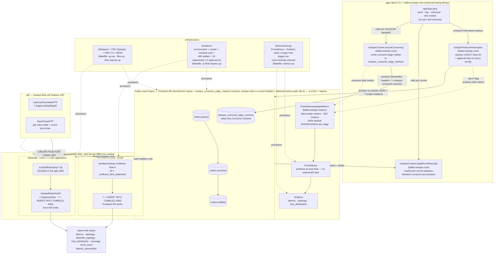
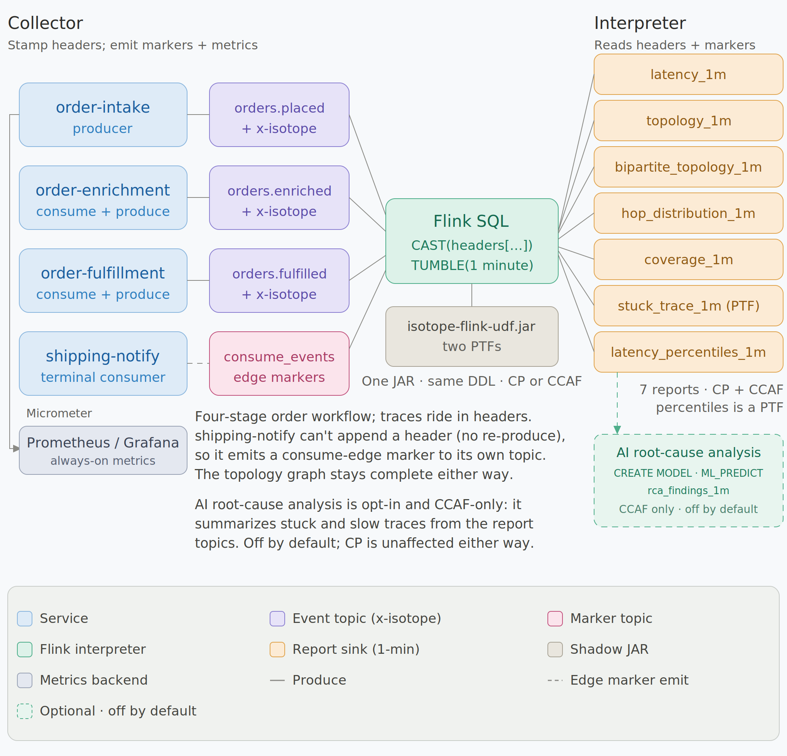

# Confluent Kafka Isotope
`confluent-kafka-isotope` is a reference implementation of an **_e-commerce order pipeline that uses Kafka Interceptors, Prometheus, and Apache Flink to capture, analyze, and report end-to-end event-tracing data in both batch and near real time_**.

Much like isotopes used to trace molecules through a biochemical pathway, each event carries lightweight metadata that allows it to be followed as it moves through Kafka topics and distributed microservices.

**_Kafka topics become the connective tissue between services_**, while Kafka Interceptors quietly transform the event pipeline itself into an observable distributed system.

---

**Table of Contents**
<!-- toc -->
- [**1.0 How an Isotope Traverses an Event Pipeline**](#10-how-an-isotope-traverses-an-event-pipeline)
- [**2.0 Project's Architecture**](#20-projects-architecture)
- [**3.0 Project layout**](#30-project-layout)
- [**4.0 Getting Started**](#40-getting-started)
  - [**4.1 Unit tests (no broker, instant)**](#41-unit-tests-no-broker-instant)
  - [**4.2 Demo CLI — see one trace propagate live**](#42-demo-cli--see-one-trace-propagate-live)
    - [**4.2.1 Full Bipartite Demo**](#421-full-bipartite-demo)
  - [**4.3 Integration tests (live Kafka via Minikube)**](#43-integration-tests-live-kafka-via-minikube)
  - [**4.4 Confluent Platform on Minikube — Production-Like Streaming, Running Locally**](#44-confluent-platform-on-minikube--production-like-streaming-running-locally)
  - [**4.5 Flink SQL reports on Confluent Cloud for Apache Flink (CCAF)**](#45-flink-sql-reports-on-confluent-cloud-for-apache-flink-ccaf)
  - [**4.6 Stateless reports via Micrometer + Prometheus/Grafana (optional)**](#46-stateless-reports-via-micrometer--prometheusgrafana-optional)
- [**5.0 Resources**](#50-resources)
<!-- tocstop -->

---

## **1.0 How an Isotope Traverses an Event Pipeline**

An **Isotope** is a **_lightweight tracing artifact attached to Kafka record headers_**. Like a biochemical isotope used to trace molecules through a metabolic pathway, it allows the journey of a record through an event-driven architecture to be observed and analyzed.

This project models a Kafka pipeline as a **bipartite graph**: *services occupy one vertex set*, *topics the other*, and *every produce and consume operation forms an edge between them*. The resulting graph provides a unified view of the complete event topology, from producers to intermediate processing services to terminal consumers.

A `ProducerInterceptor` stamps each record with an isotope and appends one hop for every `send()` operation, capturing the produce edges. Consumers call `IsotopeContext.recordConsume(...)` to emit a lightweight marker representing the corresponding consume edges, while services that consume and then produce invoke `IsotopeContext.adoptFromRecord(...)` so the trace identity persists across every hop. Apache Flink reconstructs the complete **service → topic → service** graph from the isotope headers alone, producing seven reports: end-to-end latency, latency percentiles, produce-side topology, the full bipartite topology, hop distribution, per-topic coverage (a trace-loss funnel signal), and stuck-trace detection. The same implementation runs unchanged on both Confluent Platform (self-managed) with Confluent Manager for Apache Flink (CMF) and Confluent Cloud for Apache Flink (CCAF).

> **Full architectural design of Isotope Tracing** — the header layout (`x-isotope` JSON + seven scalar headers with a worked example), how the producer interceptor gets invoked, why the consume side uses explicit calls instead of a `ConsumerInterceptor`, and the bipartite-graph rationale — is in **[docs/design.md](docs/design.md)**.

## **2.0 Project's Architecture**

A bird's-eye view of the moving parts. The demo CLI in [`app/`](app/) consumes the external tracing library ([`ai.signalroom:kafka-isotope-core`](https://github.com/j3-signalroom/kafka-isotope)), which registers a Kafka `ProducerInterceptor` that stamps an isotope into record headers on every `send()`. Consume-then-produce services propagate the inbound trace by explicitly calling `IsotopeContext.adoptFromRecord(record)`. Business events then flow through a three-topic Kafka pipeline, where Flink SQL reads the isotope metadata and emits one-minute aggregate reports.

Both runtimes run the same seven logical reports off the same source and view definitions, though each runtime keeps its own copy of the SQL. **Confluent Platform (CP)** on Minikube executes the `.fql` files under [`scripts/flink/sql/cp/`](scripts/flink/sql/cp/) as a single Flink 2.1 Confluent Manager for Apache Flink (CMF) Application (`IsotopeReportsJob`), while **Confluent Cloud for Apache Flink (CCAF)** applies the same logical SQL as inline `confluent_flink_statement` Terraform resources under [`terraform/`](terraform/). The shadow JAR from [`ptf/`](ptf/)—which powers two of the seven reports—runs unchanged on both runtimes: bundled into the CP application JAR and uploaded as a Flink artifact on CCAF.

Alongside that—**additive, opt-in, and disabled by default**—the interceptor can also emit **Micrometer** metrics for **Prometheus**, with **Grafana** providing visualization ([§4.6](#46-stateless-reports-via-micrometer--prometheusgrafana-optional)). This path produces the three **stateless** reports (`latency_1m`, `topology_1m`, and `hop_distribution_1m`) without requiring a stream processor. The remaining four reports continue to run in Flink because they depend on per-`trace_id` state or absence-of-event analysis, which falls outside Prometheus's query model.

*(Kafka is drawn once below for brevity; each runtime provisions its own Kafka cluster.)*


```mermaid
flowchart TB
    subgraph App["app/ demo CLI + kafka-isotope-core (external tracing library)"]
        Svc["app/App.java<br/>send · hop · consume · sink modes<br/>(or your real services)"]
        IPI["IsotopeProducerInterceptor<br/>(kafka-isotope-core)<br/>stamps UUIDv7 trace ID<br/>+ appends hop on every send()"]
        Adopt["IsotopeContext.adoptFromRecord()<br/>(kafka-isotope-core)<br/>explicit per-record adoption<br/>between consume and produce"]
        Mark["IsotopeContext.recordConsume()<br/>(kafka-isotope-core)<br/>emits consume-edge marker<br/>to isotope_consume_edge_markers"]
        Svc -- "producer.interceptor.classes" --> IPI
        Svc -- "calls per record" --> Adopt
        Svc -- "calls per record (for bipartite)" --> Mark
    end

    subgraph Kafka["Kafka event topics — Protobuf+SR DemoEvent values + isotope_consume_edge_markers markers; isotope rides in record headers"]
        T1[("orders.placed")] --> T2[("orders.enriched")] --> T3[("orders.fulfilled")]
        TC[("isotope_consume_edge_markers<br/>value-less consume markers")]
    end

    IPI -- "produce (x-isotope JSON + 7 scalar headers)" --> Kafka
    Kafka -- "consume + adopt" --> Adopt
    Mark -- "produce (forwarded headers + x-isotope-consumer-service)" --> TC

    subgraph Metrics["Optional metrics path (§4.6) — 3 of the 7 reports"]
        direction LR
        PIM["PrometheusIsotopeMetrics<br/>(kafka-isotope-metrics)<br/>Micrometer meters · GET /metrics<br/>:9404 default; 9410/9411/9412 per stage"]
        PROM["Prometheus<br/>windows at read time — no watermark wait"]
        GRAF["Grafana<br/>latency · topology · hop_distribution"]
        PIM --> PROM --> GRAF
    end

    IPI -. "opt-in flag<br/>produce-side meters" .-> PIM
    Mark -. "consume-side meters" .-> PIM

    subgraph PTF["ptf/ — isotope-flink-udf shadow JAR"]
        Pcts["LatencyPercentilesPTF<br/>T-Digest p50/p95/p99"]
        Stuck["StuckTracePTF<br/>per-trace state + event-time timer"]
    end

    subgraph Flink["Flink SQL reports — identical source/view DDL; sink format differs by runtime"]
        direction LR
        subgraph CP["Minikube · Flink 2.1 CMF Application"]
            SQLCP["scripts/flink/sql/cp/*.fql<br/>(bundled in the app JAR)"]
            JCP["IsotopeReportsJob<br/>1 StatementSet · 7 × INSERT INTO TUMBLE(1 MIN)<br/>Avro+SR sinks"]
            SQLCP --> JCP
        end
        subgraph CC["Confluent Cloud · CCAF"]
            TFSQL["terraform/setup-confluent-flink.tf<br/>25 × confluent_flink_statement"]
            JCC["7 × INSERT INTO TUMBLE(1 MIN)<br/>Protobuf+SR sinks"]
            TFSQL --> JCC
        end
    end

    Kafka -- "read headers only" --> CP
    Kafka -- "read headers only" --> CC
    PTF -- "bundled in app JAR<br/>registered programmatically" --> CP
    PTF -. "CREATE FUNCTION USING JAR" .-> CC

    R["report sink topics<br/>latency · topology · bipartite_topology ·<br/>hop_distribution · coverage · stuck_trace ·<br/>latency_percentiles"]
    JCP --> R
    JCC --> R

    subgraph Infra["Infrastructure"]
        direction LR
        K8S["k8s/base/ + CFK Operator + CMF 2.4 + MinIO<br/>Makefile: cp-up · flink-up · flink-reports-up"]
        TF["terraform/<br/>environment + cluster + compute pool +<br/>JAR artifact + 25 statements (+3 optional AI)<br/>Makefile: cc-flink-reports-up"]
        MON["k8s/monitoring/<br/>Prometheus + Grafana pods; scrape host<br/>stages via host.minikube.internal<br/>Makefile: metrics-up"]
    end

    K8S -. provisions .-> Kafka
    K8S -. provisions .-> CP
    TF -. provisions .-> Kafka
    TF -. provisions .-> CC
    MON -. provisions .-> PROM
    MON -. provisions .-> GRAF
```

See [§3.0](#30-project-layout) for the file tree behind each box, and [§4.0](#40-getting-started) for the run commands.

## **3.0 Project layout**

The isotope tracing library lives in its own repo — **[j3-signalroom/kafka-isotope](https://github.com/j3-signalroom/kafka-isotope)** (`ai.signalroom:kafka-isotope-core` + `ai.signalroom:kafka-isotope-metrics`). This repo is the runnable demo that consumes it.

```
app/                                    demo CLI + tests (consumes the isotope library)
  src/main/proto/ai/signalroom/kafka/isotope/proto/
    demo_event.proto                    DemoEvent message (Protobuf value schema)
  src/main/java/ai/signalroom/kafka/isotope/
    App.java                            demo CLI — pipeline-position verbs
                                        (place / enrich / fulfill / ship) + generic
                                        send / hop / consume / sink modes; registers
                                        IsotopeProducerInterceptor + starts the
                                        PrometheusIsotopeMetrics exporter (§4.6)
  src/integrationTest/java/.../         BrokerSmokeIT, ProducerInterceptorIT,
                                        ThreeStageHopPropagationIT, BipartiteTopologyIT,
                                        IsotopeTestHarness — live-broker tests; produce/consume
                                        DemoEvent via SR-framed Protobuf
                                        (need Minikube CP + SR port-forwarded)
ptf/                                    Flink reports application + PTF shadow JAR
  src/main/java/ai/signalroom/kafka/isotope/flink/
    IsotopeReportsJob.java              CP entry point — reads the bundled sql/*.fql,
                                        registers both PTFs programmatically, runs the
                                        7 INSERT INTOs as one StatementSet (CMF Application)
    LatencyPercentilesPTF.java          T-Digest p50/p95/p99 (PTF: per-window state + timers)
    StuckTracePTF.java                  per-trace state + event-time timer
    TDigests.java                       shared T-Digest (de)serialization
  src/test/java/.../                    TDigestsTest
k8s/base/                               CFK / CMF manifests (applied by `make cp-up` / `flink-up`)
  confluent-platform-c3++.yaml          Kafka / SR / Connect / ksqlDB / Control Center
  minio.yaml                            in-cluster S3-compatible store backing CMF's
                                        cmf:// artifact (JAR) storage
  cmf-values.yaml                       Helm values for CMF 2.4 — artifact storage
                                        (points at MinIO) + writable environment catalog
  cmf-flink-application.json            FlinkApplication template (envsubst'd by
                                        deploy-cmf-flink-reports.sh) — the reports job
  flink-sql-isotope.Dockerfile          custom cp-flink image for the CMF compute pool:
                                        bakes in the Kafka + avro-confluent SQL connectors
                                        and the s3-fs-hadoop plugin (`make flink-image-build`)
  flink-cluster-deployment.yaml         optional cp-flink session cluster for ad-hoc
                                        `make flink-deploy` / `make flink-sql`
                                        (not used by the reports path)
  flink-rbac.yaml                       RBAC for the cp-flink operator
k8s/monitoring/                         optional metrics showcase (§4.6) — `make metrics-up`
  00-namespace.yaml                     dedicated 'monitoring' namespace
  10-prometheus.yaml                    Prometheus pod/Service; scrapes host stages
                                        via host.minikube.internal:9410/9411/9412
  20-grafana.yaml                       Grafana pod/Service; auto-provisioned datasource
                                        + 8-panel dashboard for the 6 produce/consume meters
  kustomization.yaml                    `kubectl apply -k k8s/monitoring`
  README.md                             runbook + troubleshooting
scripts/
  port-forward-kafka.sh                 localhost:30092 → Kafka, localhost:8081 → SR
  port-forward-taskmanager.sh           Flink TaskManager web UI forward
  deploy-cmf-flink-reports.sh           builds shadow JAR + uploads it as a cmf://
                                        artifact + deploys the reports as a Flink 2.1
                                        CMF Application (runs sql/cp/*.fql)
  deploy-cc-flink-reports.sh            builds shadow JAR + wraps `terraform apply`
                                        for the CCAF path
  cc-cli-env.sh                         pulls Kafka + SR creds from `terraform output`,
                                        builds the JAAS string, exports BOOTSTRAP /
                                        SR_URL / KAFKA_KEY / KAFKA_SECRET / JAAS / ...
  cc-app-run.sh                         thin wrapper around `./gradlew :app:run` that
                                        sources cc-cli-env.sh and injects the six -D flags
  flink/README.md                       Flink SQL reports — runtime split (CP=7 reports/Avro+SR,
                                        CCAF=7 reports/Protobuf+SR), layout, operations
  flink/sql/cp/                         CP Flink SQL: 00_source_table, 01_register_functions,
                                        05_isotope_view, 06_consume_events_view,
                                        05_report_sinks (avro-confluent),
                                        10/20/25/30/40/60/70 INSERT INTO reports, 99_teardown
                                        (CCAF SQL is inlined under terraform/setup-confluent-flink.tf.)
  flink/sql/ccaf-ai/                     optional AI extension (CCAF-only, off by default)
    trace_rca.fql                       PoC: 8th, AI-generated report — turns each
                                        stuck-trace alert into an LLM root-cause
                                        hypothesis via CREATE MODEL + ML_PREDICT
                                        (wired in by terraform/setup-ccaf-ai.tf)
terraform/                              CCAF infrastructure-as-code (`make cc-flink-reports-up`)
  providers.tf                          Confluent provider — cloud key/secret vars
  versions.tf                           required Terraform (>= 1.13) + provider versions
  variables.tf                          confluent_api_key/secret, cloud, region, day_count
  data.tf                               organization lookup + other data sources
  setup-confluent-environment.tf        environment (ESSENTIALS stream-governance package)
  setup-confluent-kafka.tf              Kafka cluster + Kafka API key rotation module
                                        (iac-confluent-api_key_rotation-tf_module)
  setup-confluent-flink.tf              service account + 6 role bindings, compute pool,
                                        artifact upload, SR API key rotation, and 25 inline
                                        `confluent_flink_statement` resources: 4 ALTER TABLE
                                        + 3 VIEW + 7 sink CREATE TABLE + 2 DROP FUNCTION +
                                        2 CREATE FUNCTION (both PTFs) + 7 INSERT INTO
  setup-ccaf-ai.tf                      OPTIONAL AI trace-RCA report — 3 extra
                                        statements (CREATE MODEL + Protobuf sink +
                                        INSERT … ML_PREDICT); gated on
                                        var.enable_trace_rca (default false)
  outputs.tf                            environment_id, bootstrap, SR URL, rotating
                                        Kafka + SR API key/secret outputs (sensitive)
docs/                                   extracted long-form docs (linked from the README)
  design.md                             how the isotope is carried (§1.0 deep-dive)
  isotope_diagram.png                   visual representation of the isotope and its flow through Kafka headers 
  runbook-minikube.md                   full CP-on-Minikube run sequence (§4.4)
  runbook-ccaf.md                       full CCAF / Terraform run sequence (§4.5)
  metrics.md                            Micrometer/Prometheus meter + PromQL reference (§4.6)
  terraform.png                         rendered resource graph (embedded in §4.5)
Makefile                                cp-up / flink-up / kafka-pf-up / flink-reports-up /
                                        cc-flink-reports-up / cc-flink-reports-down /
                                        metrics-up / metrics-down / metrics-delete / ...
```

## **4.0 Getting Started**
First, clone the repo to your local machine using the [GitHub CLI](https://cli.github.com/):

```bash
gh repo clone j3-signalroom/confluent-kafka-isotope
```

Change to the repo directory:

```bash
cd /path/to/confluent-kafka-isotope
```

Then decide what you want to run:

### **4.1 Unit tests (no broker, instant)**

```bash
./gradlew test                       # runs :ptf:test (the app has no unit tests in this repo)
# or scoped:
./gradlew :ptf:test                  # TDigestsTest — T-Digest sketch (de)serialization + accuracy
```
### **4.2 Demo CLI — see one trace propagate live**

The fastest way to watch the isotope mechanic. Requires the cluster to be up and the Kafka + SR forwards running (see step 3 below for the bring-up commands). The CLI has two argument styles — **pipeline-position verbs** that bake in the orders.* topic chain (recommended for the demo) and **generic verbs** that take raw topic + service args (for ad-hoc inspection on any topic):

| Verb | Args | What it does |
|---|---|---|
| `place`   | `[payload]`                         | Produces one isotope-tagged `DemoEvent` to `orders.placed` as `order-intake-service` (default payload: `hello`), then exits. Auto-creates the topic. |
| `enrich`  | —                                   | Consumes from `orders.placed`, adopts the isotope, **emits a consume-edge marker to `isotope_consume_edge_markers` as `order-enrichment-service`**, then re-produces to `orders.enriched`. Runs until Ctrl-C. |
| `fulfill` | —                                   | Same as `enrich` but for `orders.enriched → orders.fulfilled` as `order-fulfillment-service`. Runs until Ctrl-C. |
| `ship`    | —                                   | Terminal consumer for `orders.fulfilled` as `shipping-notification-service`. **Emits a consume-edge marker** so it shows up in the bipartite report; does not re-produce. Runs until Ctrl-C. |
| `send`    | `<topic> <service> <payload>`       | Generic produce. Auto-creates the topic. |
| `hop`     | `<in-topic> <out-topic> <service>`  | Generic consume-then-produce; emits a consume-edge marker. Runs until Ctrl-C. |
| `consume` | `<topic> <service>`                 | Generic terminal-consume; emits a consume-edge marker and pretty-prints the trail. Runs until Ctrl-C. |
| `sink`    | `<topic>`                           | Passive peek — pretty-prints the isotope trail but does NOT emit a consume marker. Use for ad-hoc inspection. Runs until Ctrl-C. |

#### **4.2.1 Full Bipartite Demo**
**A 4-stage chain (full bipartite graph) in four terminals.** Run them in pipeline order — `place` produces, then `enrich` / `fulfill` / `ship` each pick up where the previous stage left off:

```bash
# Terminal A — kick the chain off (run repeatedly to send more)
./gradlew :app:run --args="place 'hello world'" -q

# Terminal B — first hop: orders.placed → orders.enriched
./gradlew :app:run --args="enrich" -q

# Terminal C — middle hop: orders.enriched → orders.fulfilled
./gradlew :app:run --args="fulfill" -q

# Terminal D — terminal consumer (prints the full 3-hop trail AND emits a
#              consume-edge marker so shipping-notification-service shows up
#              in the bipartite report)
./gradlew :app:run --args="ship" -q
```

Terminal D's output for each record shows the same `trace_id` across all three hops, `origin = order-intake-service` (never reassigned), and `hops[]` listing `order-intake-service → order-enrichment-service → order-fulfillment-service` in order with per-hop timestamps. The bipartite-topology report sees all six edges: produce edges `order-intake-service → orders.placed`, `order-enrichment-service → orders.enriched`, `order-fulfillment-service → orders.fulfilled` and consume edges `orders.placed → order-enrichment-service`, `orders.enriched → order-fulfillment-service`, `orders.fulfilled → shipping-notification-service`. Swap `consume` for `sink` if you only want to inspect records without recording the terminal edge. Override endpoints via `-Dkafka.bootstrap=…` / `-Dschema.registry.url=…` if you're not on the default Minikube layout.



> **Just want the commands?** The full local stack-up sequence (cluster → Kafka → Flink → reports → traffic → teardown) is consolidated in **[docs/runbook-minikube.md](docs/runbook-minikube.md)**.

### **4.3 Integration tests (live Kafka via Minikube)**

Bring up the local Confluent Platform stack and port-forward Kafka + SR:

```bash
make minikube-start                  # one-time
make cp-up                           # CFK Operator + Kafka/SR/Connect/ksqlDB/C3 (~5 min)
make kafka-pf-up                     # localhost:30092 → Kafka, localhost:8081 → Schema Registry
```

Then run the suite:

```bash
./gradlew :app:integrationTest                                          # every IT below
./gradlew :app:integrationTest --tests '*ProducerInterceptorIT'         # just one
```

Override the endpoints if needed:

```bash
./gradlew :app:integrationTest \
    -PkafkaBootstrap=localhost:30092 \
    -PschemaRegistryUrl=http://localhost:8081
```

Tear down forwards when done:

```bash
make kafka-pf-down
```

The integration tests cover:

| Test | What it verifies |
|---|---|
| `BrokerSmokeIT` | AdminClient can create/list/delete a topic via the NodePort port-forward |
| `ProducerInterceptorIT` | A consumer sees the `x-isotope` JSON header + all 7 scalar reporting headers with the expected origin/hop values, and the Protobuf round-trip preserves `DemoEvent.source` / `payload` |
| `ThreeStageHopPropagationIT` | `order-intake-service → topic-AB → order-enrichment-service → topic-BC → order-fulfillment-service` produces a stable trace ID, 2-hop trail in send order, and correct scalar headers (origin = `order-intake-service`, this = `order-enrichment-service`, hop count = 2) at the terminal; consume-then-produce hops use `IsotopeContext.adoptFromRecord` to carry the trace forward |
| `BipartiteTopologyIT` | The 4-stage `order-intake-service → topic-AB → order-enrichment-service → topic-BC → order-fulfillment-service → topic-CD → shipping-notification-service` chain emits exactly three consume-edge markers to a per-test markers topic — one per consume edge. Every marker carries the trace ID, forwarded `x-isotope-*` scalars describing the upstream producer, and the new `x-isotope-consumer-service` naming the downstream consumer. Asserts the `(consumer_service, consumed_topic)` set is exactly the three pairs of stages 2-4 |

### **4.4 Confluent Platform on Minikube — Production-Like Streaming, Running Locally**

> **Caveat:** Minikube is a single-node cluster. It is not a production-like environment, but it is sufficient for local development and testing. The Confluent Platform (CP) stack runs in Minikube, and you can port-forward Kafka and Schema Registry to your local machine.

To **_run_**, **_test_**, and **_debug_** Apache Flink like a production engineer, this project provides a full Confluent Platform stack running locally on [Minikube](https://minikube.sigs.k8s.io/docs/) — no cloud required.

You get a production-like environment on your machine, with all the components you’d expect in a real deployment:

- **Confluent Platform** (KRaft mode) via Confluent for Kubernetes (CFK)
- **Apache Flink 2.1.2** via the Confluent Flink Kubernetes Operator 1.140.1
- **Confluent Manager for Apache Flink (CMF) 2.4.0** for Flink environment management

To run this project, you’ll need **macOS (with Homebrew)** or **Linux (with apt-get)**.  The full stack — **Minikube + Confluent Platform + Flink + CMF** — is resource-intensive and designed to mirror a production environment. Therefore, the following defaults are recommended:

| Resource | Default |
| -------- | ------- |
| CPUs     | 6       |
| Memory   | 20 GB   |
| Disk     | 50 GB   |

> These settings ensure stable performance across all components. You can tune them as needed, but lower resource levels may cause pod restarts or degraded performance.

Seven reports — five pure Flink SQL plus two JAR-backed PTFs — run as a **single Flink 2.1 CMF Application** (`IsotopeReportsJob`, one StatementSet, seven sinks) submitted through CMF and executed by the Confluent Flink Kubernetes Operator. No raw session cluster is involved; `k8s/base/flink-cluster-deployment.yaml` (`make flink-deploy` / `make flink-sql`) is a separate, optional path for ad-hoc SQL. Confluent Cloud runs the same seven reports from its own copy of the SQL, inlined in Terraform — see **[§4.5](#45-flink-sql-reports-on-confluent-cloud-for-apache-flink-ccaf)** for that path; this section is the local-Minikube one.

**The full bring-up sequence — cluster → Flink → reports → traffic → teardown — is consolidated in [docs/runbook-minikube.md](docs/runbook-minikube.md).** The short version: `make flink-up` then `make flink-reports-up`, then drive traffic across **multiple** 1-minute windows (a single burst sits in one open window forever — the watermark has to cross `window_end` for a tumbling window to emit) and wait ~90s after the last record.

Report sink topics ride **Avro+SR** (`avro-confluent`, auto-registered on first write) so Control Center renders them natively — a deliberate *format-by-domain* split: app events are **Protobuf+SR** (`DemoEvent`), Flink aggregates are **Avro+SR** (cp-flink ships no SR-integrated Protobuf format), and the consume-edge marker topic `isotope_consume_edge_markers` is **null-value / headers-only**. Not a defect — a clean split by domain.

### **4.5 Flink SQL reports on Confluent Cloud for Apache Flink (CCAF)**

The CCAF parallel of [§4.4](#44-confluent-platform-on-minikube--production-like-streaming-running-locally), driven by Terraform under [terraform/](terraform/) — no local cluster. One `make` target spins up a fresh Confluent Cloud environment, Kafka cluster, compute pool, two rotating service-account API key pairs (Kafka + Schema Registry), the uploaded PTF JAR, and 25 `confluent_flink_statement` resources (4 ALTER TABLE + 3 VIEW + 7 sink CREATE TABLE + 2 CREATE FUNCTION + 7 INSERT INTO, plus 2 transient DROP FUNCTION). The shape mirrors [`apache_flink-kickstarter-ii`](https://github.com/j3-signalroom/apache_flink-kickstarter-ii) — same provider version and `iac-confluent-api_key_rotation-tf_module`.


**The full provision → deploy → traffic → teardown sequence is consolidated in [docs/runbook-ccaf.md](docs/runbook-ccaf.md).** The short version: `export` a Cloud-level Confluent Cloud API key, `make cc-flink-reports-up` (~6–8 min first run; idempotent re-applies), drive traffic with `scripts/cc-app-run.sh place|enrich|fulfill|ship` across **multiple** 1-minute windows (a single burst sits in one open window forever, and you wait ~90s after the last record), then `make cc-flink-reports-down` to `terraform destroy` the whole environment.

Two CCAF-specific design points worth keeping in the README:

**Format-by-runtime (not -by-domain).** CP's reports land on **Avro+SR** (`'value.format' = 'avro-confluent'` in [scripts/flink/sql/cp/05_report_sinks.fql](scripts/flink/sql/cp/05_report_sinks.fql)). CCAF's reports land on **Protobuf+SR** (`'value.format' = 'proto-registry'` in each sink's WITH clause in [terraform/setup-confluent-flink.tf](terraform/setup-confluent-flink.tf)). The two runtimes' SQL is otherwise unshared: CP's lives hardcoded in [scripts/flink/sql/cp/](scripts/flink/sql/cp/), CCAF's lives inline as `confluent_flink_statement` resources in [terraform/setup-confluent-flink.tf](terraform/setup-confluent-flink.tf).

**Why percentiles is a PTF.** CCAF rejects all `CREATE FUNCTION` statements for user-defined *aggregate* functions ("aggregate functions are not supported"). Percentiles would naturally be an aggregate, so to keep the report portable it's implemented as a `ProcessTableFunction` instead — `LATENCY_PERCENTILES` (class `LatencyPercentilesPTF`) does its own 1-minute tumbling-window aggregation over a T-Digest sketch via per-window state and event-time timers. A PTF has no such restriction, so it registers and runs on **both** runtimes, exactly like `STUCK_TRACE_PTF`. Both runtimes therefore run the same seven reports: `latency` (avg/min/max), `topology` (produce-side), `bipartite_topology` (full service↔topic↔service graph), `hop_distribution`, `coverage`, `stuck_trace`, and `latency_percentiles` (p50/p95/p99).

**Optional: AI root-cause analysis (CCAF-only, off by default).** Beyond the seven deterministic reports, [terraform/setup-ccaf-ai.tf](terraform/setup-ccaf-ai.tf) wires an **eighth, AI-generated report** that turns each stuck-trace *alert* into a natural-language root-cause hypothesis plus a one-line remediation. It adds three `confluent_flink_statement` resources — `CREATE MODEL trace_rca` (a remote text-generation model), a `proto-registry` sink `isotope_report_trace_rca_1m`, and an `INSERT … SELECT … LATERAL TABLE(ML_PREDICT('trace_rca', …))` — all **gated on `var.enable_trace_rca` (default `false`)**, so a normal `make cc-flink-reports-up` is completely un``affected. The model is invoked once per *alert* (the low-volume 1-minute stuck-trace report topic), never per record, and its output lands on its own topic — it never overwrites the deterministic reports. Defaults target OpenAI (`gpt-4o`); for Claude hosted by Anthropic — a **direct** CCAF provider — set `rca_model_provider = "anthropic"`, `rca_model_endpoint = "https://api.anthropic.com/v1/messages"`, a Claude `rca_model_version`, and your Claude `rca_model_api_key` (bare API key, no AWS auth), plus the Anthropic-required `rca_model_max_tokens`. Claude via AWS Bedrock (`rca_model_provider = "bedrock"`) also works but isn't required. The standalone SQL PoC — a `CREATE MODEL` + `ML_PREDICT` walkthrough with provider notes and alternative options — is in [scripts/flink/sql/ccaf-ai/trace_rca.fql](scripts/flink/sql/ccaf-ai/trace_rca.fql).

### **4.6 Stateless reports via Micrometer → Prometheus/Grafana (optional)**

Three of the seven reports — `latency_1m`, `topology_1m`, `hop_distribution_1m` — are pure stateless scalar aggregation over bounded-cardinality dimensions (service / topic / hop_count, never `trace_id`). Those don't need a stream processor: the [producer interceptor](https://github.com/j3-signalroom/kafka-isotope/blob/main/kafka-isotope-core/src/main/java/ai/signalroom/kafka/isotope/IsotopeProducerInterceptor.java) already has every value in scope on each `send()`, so it emits them as **Micrometer** meters ([PrometheusIsotopeMetrics.java](https://github.com/j3-signalroom/kafka-isotope/blob/main/kafka-isotope-metrics/src/main/java/ai/signalroom/kafka/isotope/metrics/PrometheusIsotopeMetrics.java)) and lets **Prometheus** window them at read time, with **Grafana** on top. The other four (`latency_percentiles`, `coverage`, `bipartite_topology`, `stuck_trace`) are per-`trace_id` stateful or absence-of-event problems Prometheus can't express, so they **stay in Flink**. This path is **additive and opt-in** — a 3-Micrometer / 4-Flink split.

> **Full details** — the meter/PromQL reference, the produce- and consume-side signals, the two deliberate gaps (`distinct_traces`, windowed `min`), and why percentiles stays a PTF — are in **[docs/metrics.md](docs/metrics.md)**. The one-command Prometheus + Grafana showcase has its own runbook: **[k8s/monitoring/README.md](k8s/monitoring/README.md)** (`make metrics-up`).

## **5.0 Resources**
- [Medium Article: Kafka’s quiet observability superpower — Kafka Interceptors](https://thej3.com/kafkas-quiet-observability-superpower-kafka-interceptors-aca88c33867e)