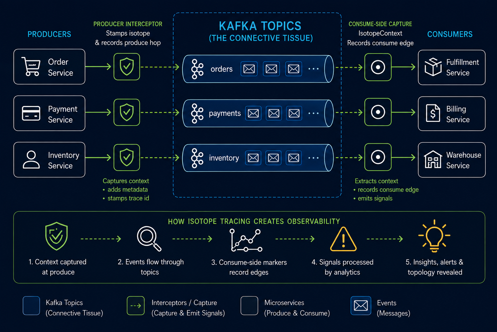
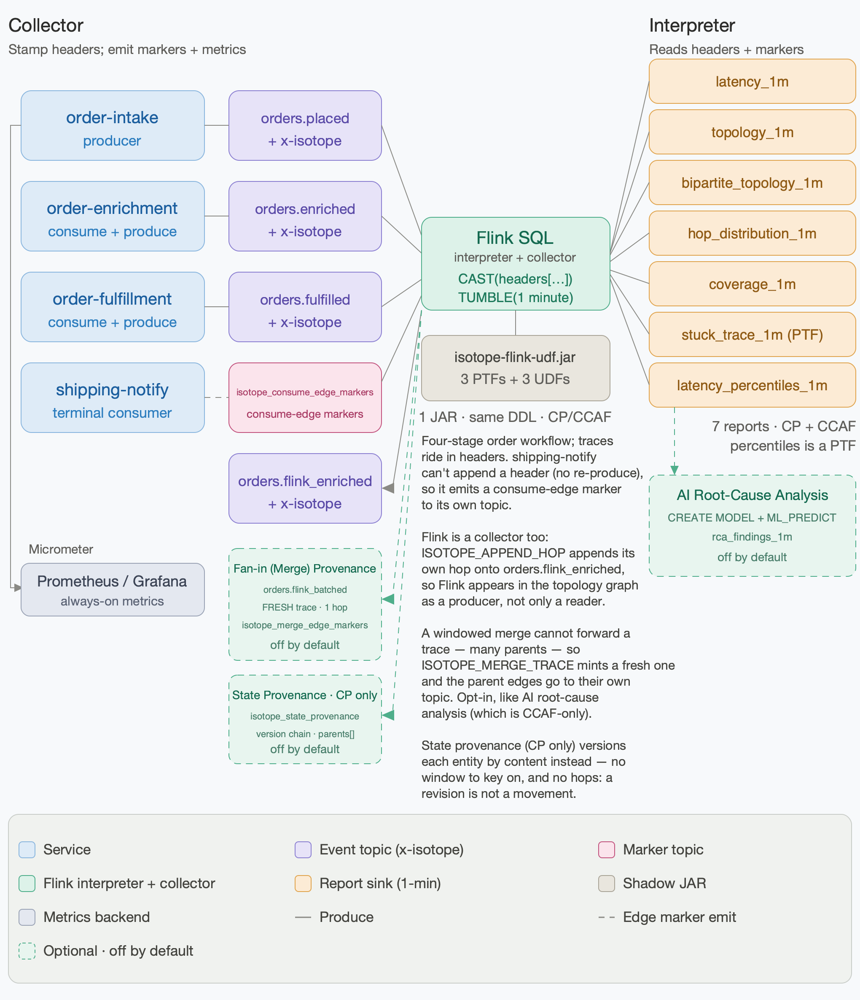
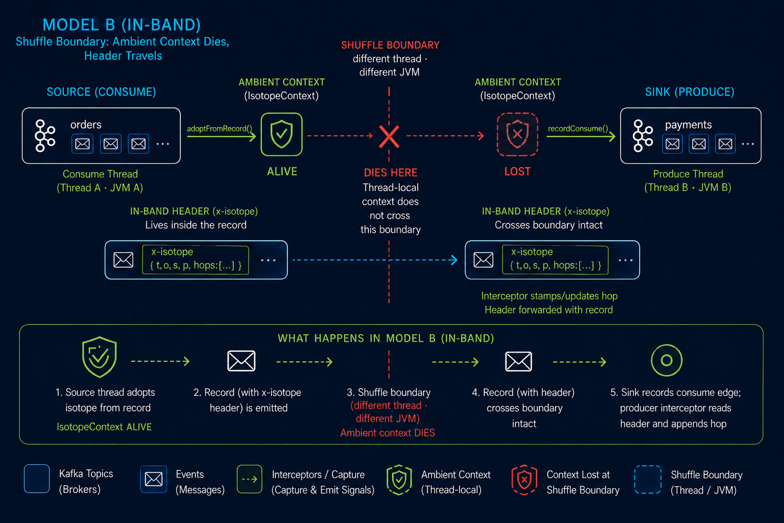
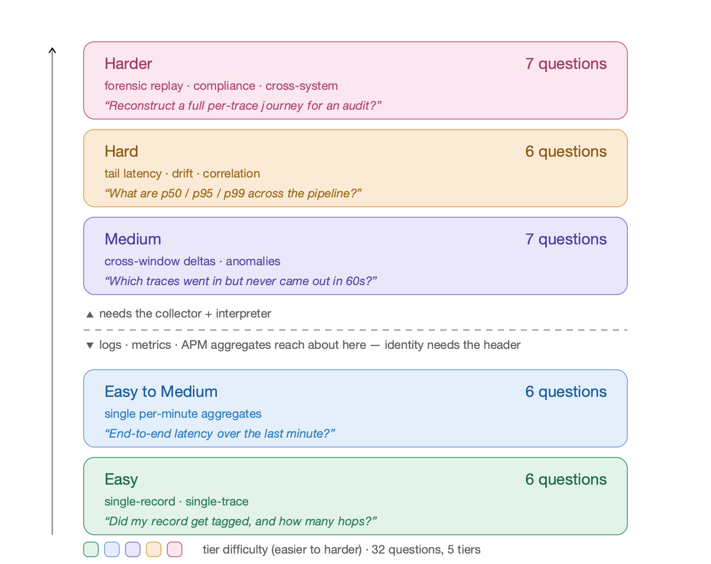
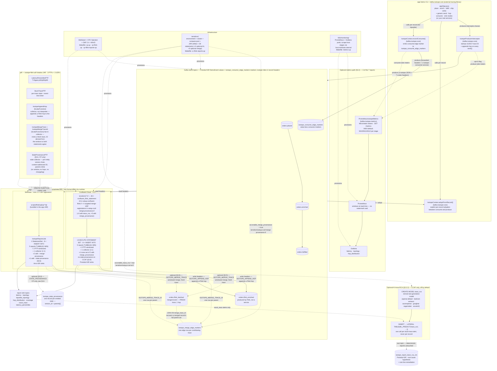
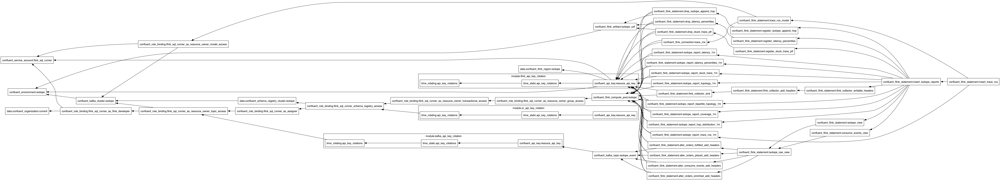

# Confluent Kafka Isotope

**Table of Contents**
<!-- toc -->
- [**Purpose**](#purpose)
- [**1.0 How an Isotope Traverses an Event Pipeline**](#10-how-an-isotope-traverses-an-event-pipeline)
  + [**1.1 Anatomy of the Isotope Tracing Artifact**](#11-anatomy-of-the-isotope-tracing-artifact)
- [**2.0 Architecture**](#20-architecture)
- [**3.0 Getting Started**](#30-getting-started)
  + [**3.1 Integration Tests with Confluent Platform on Minikube**](#31-integration-tests-with-confluent-platform-on-minikube)
  + [**3.2 Seven Scalar Headers Flink SQL Reports with Apache Flink on Minikube**](#32-seven-scalar-headers-flink-sql-reports-with-apache-flink-on-minikube)
  + [**3.3 Seven Scalar Headers Flink SQL Reports with Confluent Cloud for Apache Flink**](#33-seven-scalar-headers-flink-sql-reports-with-confluent-cloud-for-apache-flink)
    - [**3.3.1 Why `latency_percentiles` is a `ProcessTableFunction` (PTF)**](#331-why-latency_percentiles-is-a-processtablefunction-ptf)
    - [**3.3.2 [OPTIONAL] Eighth Report — AI Root-Cause Analysis (RCA)**](#332-optional-eighth-report--ai-root-cause-analysis-rca)
  - [**3.4 [OPTIONAL] Prometheus Metrics Reporting with Grafana Visualization**](#34-optional-prometheus-metrics-reporting-with-grafana-visualization)
  - [**3.5 [OPTIONAL] Fan-in (Merge) Provenance**](#35-optional-fan-in-merge-provenance)
  - [**3.6 [OPTIONAL] State-Level Provenance**](#36-optional-state-level-provenance)
- [**Resources**](#resources)
<!-- tocstop -->

---

# Purpose

`confluent-kafka-isotope` is a reference implementation of an **_e-commerce order pipeline that uses Kafka Interceptors to capture end-to-end event-tracing data, with Prometheus and Apache Flink analyzing and reporting that data in batch and near real time_**, as visualized below.



Much like isotopes used to trace molecules through a biochemical pathway, each event carries lightweight metadata that allows it to be followed as it travels through Kafka topics and distributed microservices.

**Kafka topics** become the **connective tissue between services**, while **Kafka Interceptors quietly transform** the event pipeline itself into an **observable distributed system**.

This project demonstrates how **Kafka Interceptors become collectors** — inserting the isotope into record headers in place and, at terminal consumers, emitting consume-edge markers — while **Flink SQL serves as the interpreter**, reading those headers directly to produce seven 1-minute reports from a single JAR on both Confluent Platform and Confluent Cloud for Apache Flink (CCAF). Optionally, the producer interceptor can **emit Micrometer metrics to Prometheus as an always-on aggregate layer** alongside the per-trace Flink reports.  (As depicted in the diagram below.)



**Flink is now a collector too.** A second propagation model lets a Flink statement stamp its own hop, so Flink appears in the topology graph as a producer rather than only as a reader. The interceptor propagates *out-of-band* — the in-flight isotope lives in an `IsotopeContext` `ThreadLocal` that `onSend()` reads on the same thread — which is correct in the services, where one thread owns a whole consume→produce hop. That cannot work in Flink: a shuffle resumes a record on a different thread in a different JVM, and Flink SQL has no user-visible thread to attach to at all. So Flink propagates *in-band*, carrying the isotope in the record's own headers via a writable `headers` metadata column and the `ISOTOPE_APPEND_HOP` scalar UDF. Two models, one wire format — every header the UDF writes is byte-identical to the interceptor's, so the reports cannot tell the two collectors apart. See [docs/flink-collector.md](docs/flink-collector.md).



**A third collector records state, not messages.** The first two both record *message* lineage, and an isotope is an itinerary — one identity and its ordered hops — which is a truthful derivation record only while every step is 1:1. A row in an upsert table has no itinerary: its current value is the fold of every change that ever touched it, a DAG over versions rather than a path over messages. Asking whether a `-U`/`+U` pair is one hop or two has no good answer, because the question is wrong. So the third collector stamps **no hops at all**. `STATE_PROVENANCE` publishes one record per emitted state, identified by its *content* rather than by a window, carrying the versions it was derived from inline — which is what lets a lineage stream describing an *updating* table stay append-only end to end. Opt-in and CP-only; see [docs/state-provenance.md](docs/state-provenance.md).

That makes three collectors, distinguished by what they can truthfully record:

| Collector | Records | Propagation | Availability |
|---|---|---|---|
| `IsotopeProducerInterceptor` | message lineage — one hop per `send()` | out-of-band (`ThreadLocal`) | always on |
| `ISOTOPE_APPEND_HOP` | message lineage — Flink's own hop, 1:1 statements only | in-band (record headers) | always on; opt-in fan-in variant for windowed merges mints a fresh trace rather than forwarding one ([§3.5](#35-optional-fan-in-merge-provenance)) |
| `STATE_PROVENANCE` | state lineage — a content-addressed version chain per entity | neither: a parallel record keyed by version | opt-in, CP only ([§3.6](#36-optional-state-level-provenance)) |

The first two share one wire format, so no report can tell them apart. The third deliberately does not participate in it — which is the point: overloading the hop list to mean "revision" would fabricate movement that never happened.

With this approach, developers gain **end-to-end observability** into the flow of events through the Kafka-based microservices architecture, enabling both **real-time monitoring** and **post-hoc analysis** of event traces.

This end-to-end observability of the isotope tracing pipeline creates a **ladder of insights**, allowing developers to trace each event’s journey, identify bottlenecks, and improve the performance and reliability of the entire system. The ladder is organized into **five tiers that answer 32 questions**, as visualized below. All 32 are enumerated, tier by tier, in [docs/metrics.md §6](docs/metrics.md#60-mapping-questions-to-promql).



<details>
<summary>Easy — single-record, single-trace</summary>

- _Did my record get tagged?_
- _What’s the origin of this trace?_
- _How many hops has this record taken?_
- _Where did this trace go?_
- _Did the trace ID survive a consume-then-produce hop?_
- _Which pipeline does this trace belong to?_
</details>

<details>
<summary>Easy to Medium — single per-minute aggregates</summary>

- _End-to-end latency from_ `order-intake-service` _through to_ `shipping-notification-service` _over the last minute?_
- _What is the actual service graph?_
- _How many distinct traces hit each topic per minute?_
- _Is the hop-count distribution as expected, or are there long tails suggesting retry storms?_
- _Are any traces hitting the 32-hop ceiling and getting eviction-marked?_
- _How many traces is each pipeline carrying, minute by minute?_
</details>

<details>
<summary>Medium — cross-window deltas, anomalies, multi-report joins</summary>

- _Did latency get worse after the 2 pm deploy?_
- _What percentage of traces that entered at_ `orders.placed` _made it all the way through_ `orders.fulfilled` _to the shipping consumer?_
- _Where in the pipeline are records being dropped?_
- _Are some traces being duplicated at the terminal sink?_
- _Which traces went in but never came out within 60 seconds of event time?_
- _Where did each stuck trace last get seen?_
- _When a new service goes live, when does it first appear in the topology?_
</details>

<details>
<summary>Hard — tail behavior, drift detection, correlated analysis</summary>

- _What are the p50/p95/p99 latencies across the whole pipeline?_
- _Which one-minute window had the worst tail latency yesterday, and which traces drove it?_
- _Is the deployed topology what we documented, or has it drifted?_
- _Has the stuck-trace rate spiked since a recent deploy?_
- _Do stuck traces correlate with a specific producer, partition, or time of day?_
- _Does the same isotope mechanism work identically on OSS Apache Flink (Confluent Platform) and Confluent Cloud for Apache Flink (CCAF)?_
</details>

<details>
<summary>Harder — forensic replay, compliance, cross-system joins</summary>

- _For a specific business event two weeks ago, what path did its trace take?_
- _Did this customer’s order traverse all the services it should have?_
- _Can we reconstruct the full per-trace journey for an audit?_
- _For Sarbanes-OXley Act (SOX): prove that every transaction was either completed or logged as stuck._
- _Which input records produced this merged output?_
- _Why was this trace stuck — not just that it was?_
</details>

---

## **1.0 How an Isotope Traverses an Event Pipeline**
An **Isotope** is a ***lightweight tracing artifact attached to Kafka record headers***. Like a biochemical isotope used to trace molecules through a metabolic pathway, it allows the journey of a record through an event-driven architecture to be observed and analyzed.

This project models a Kafka pipeline as a **bipartite graph**: **services occupy one vertex set**, **topics the other**, and **every produce and consume operation forms an edge between them**. The resulting graph provides a unified view of the complete event topology, from producers to intermediate processing services to terminal consumers.

A `ProducerInterceptor` stamps the isotope onto each record and appends one hop for every `send()` operation, capturing the **produce edges**. Consumers call `IsotopeContext.recordConsume()` to emit a lightweight marker representing the corresponding **consume edges**.

For services that consume and then produce, Kafka Isotope supports **two complementary propagation models** for carrying the trace identity forward:

* **Out-of-band propagation** — `IsotopeContext.adoptFromRecord()` places the inbound isotope into thread-local context, where the subsequent `send()` retrieves it. This model is designed for conventional Kafka applications where the consume → produce hop remains within the same execution context.

* **In-band propagation** — the isotope remains attached to the record as it moves through the processing graph. Because propagation does not depend on thread-local state, the trace identity can survive thread, task, shuffle, network, and JVM boundaries such as those introduced by Apache Flink.

Both models produce the same Kafka isotope headers and preserve the same trace identity across hops; they differ only in **how that identity is propagated between consume and produce**: out-of-band through thread-local context, or in-band with the record itself.

Apache Flink combines the isotope headers and consume-edge markers to reconstruct the complete **service → topic → service** graph and produce seven reports:

* **End-to-end latency**
* **Latency percentiles**
* **Produce-side topology**
* **Full bipartite topology**
* **Hop distribution**
* **Per-topic coverage** — a trace-loss funnel signal
* **Stuck-trace detection**

The same implementation runs on both **Confluent Platform (self-managed)** with **Confluent Manager for Apache Flink (CMF)** and **Confluent Cloud for Apache Flink (CCAF)**.

For more in-depth discussion of the **Isotope Tracing Design**, including the two propagation models, see [docs/design.md](docs/design.md).

### **1.1 Anatomy of the Isotope Tracing Artifact**
The isotope is a **JSON object** that travels in the `x-isotope` Kafka record header, accompanied by **seven scalar headers** that Flink SQL reads directly. The JSON carries the trace identity, origin metadata, and full ordered hop history, while the scalar headers provide a flattened view of the most-recent-hop data for easier SQL access.

* **Header `x-isotope`** (JSON bytes) carries the full trace state and hop history, forwarded by every hop:

  * `t` — 16-byte **UUIDv7** trace ID ([RFC 9562](https://www.rfc-editor.org/rfc/rfc9562?utm_source=chatgpt.com)): 48-bit millisecond timestamp in the high bits + 74 random bits. It remains stable for the life of the trace, and lexicographic byte order matches creation order — sorting trace IDs therefore produces chronological creation order. The random bits come from `ThreadLocalRandom`, not `SecureRandom`: a trace ID is a public observability identifier carried in Kafka headers, so the requirement is collision avoidance rather than unpredictability, without imposing `SecureRandom` overhead on every produced record.

  * `o` — origin timestamp (ms), identical to the timestamp embedded in the UUIDv7 trace ID; retained as a separate field for typed access from Flink SQL without decoding the UUID bytes.

  * `s` — origin service name, stamped once and forwarded unchanged for the life of the trace.

  * `p` — origin pipeline name (for example, `orders` vs. `location`); like `s`, stamped once at the origin and forwarded unchanged on every hop, allowing reports to slice traces by logical pipeline.

  * `h` — ordered list of hops, each represented as `{s: service, t: topic, m: tsMs}`.

  * `x` — `true` if the hop list exceeded `MAX_HOPS = 32` and the oldest hop was evicted.

* **Seven scalar headers** (UTF-8 strings) carry the most-recent-hop view, allowing Flink SQL to read them directly via `CAST(headers['x-isotope-…'] AS STRING)` without parsing the JSON hop array or requiring a UDF on either CCAF or CP Flink. See [scripts/flink/README.md](../scripts/flink/README.md) for the complete scalar-header table.

<details>

<summary>Sample Isotope Tracing Artifact</summary>

> Formatted for readability; the actual header is in JSON bytes

```json
{
	"x-isotope-hop-count": "1",
	"x-isotope": "{\"t\":\"AZ69OS8OeG+9zufGfF2sbw==\",\"o\":1781291101966,\"s\":\"order-intake-service\",\"p\":\"order\",\"h\":[{\"s\":\"order-intake-service\",\"t\":\"orders.placed\",\"m\":1781291101966}],\"x\":false}",
	"x-isotope-trace-id": "019ebd392f0e786fbdcee7c67c5dac6f",
	"x-isotope-this-service": "order-intake-service",
	"x-isotope-origin-service": "order-intake-service",
	"x-isotope-this-topic": "orders.placed",
	"x-isotope-origin-ts": "1781291101966",
	"x-isotope-pipeline": "order"
}
```
</details>

## **2.0 Architecture**
A bird's-eye view of the moving parts. The demo CLI in [`app/`](app/) consumes the external tracing library ([`ai.signalroom:kafka-isotope-core`](https://github.com/j3-signalroom/kafka-isotope)), which registers a Kafka `ProducerInterceptor` that stamps an isotope into record headers on every `send()`. Consume-then-produce services propagate the inbound trace by explicitly calling `IsotopeContext.adoptFromRecord(record)`. Business events then flow through a three-topic Kafka pipeline, where Flink SQL reads the isotope metadata and emits one-minute aggregate reports.

Both runtimes run the same seven logical reports off the same source and view definitions, though each runtime keeps its own copy of the SQL. **Confluent Platform (CP) + Flink** on Minikube executes the `.fql` files under [`scripts/flink/sql/cp/`](scripts/flink/sql/cp/) as a single Flink 2.1 Confluent Manager for Apache Flink (CMF) Application (`IsotopeReportsJob`), while **Confluent Cloud for Apache Flink (CCAF)** applies the same logical SQL as inline `confluent_flink_statement` Terraform resources under [`terraform/`](terraform/). The shadow JAR from [`ptf/`](ptf/)—which powers two of the seven reports plus the collector UDF—runs unchanged on both runtimes: bundled into the CP application JAR and uploaded as a Flink artifact on CCAF.

Alongside the seven reports, both runtimes run one **collector** INSERT that forwards `orders.placed` to `orders.flink_enriched`, appending a Flink hop on the way. Each side runs all eight as a **single job**: CP through `IsotopeReportsJob`'s `StatementSet`, CCAF through `EXECUTE STATEMENT SET BEGIN ... END`. That matters for cost as much as symmetry — every separate CCAF statement carries its own 1-CFU floor, so eight statements meant eight floors.

Alongside that—**additive, opt-in, and disabled by default**—the interceptor can also emit **Micrometer** metrics for **Prometheus**, with **Grafana** providing visualization ([§3.4 Prometheus Metrics Reporting with Grafana Visualization](#34-optional-prometheus-metrics-reporting-with-grafana-visualization)). This path produces the three **stateless** reports (`latency_1m`, `topology_1m`, and `hop_distribution_1m`) without requiring a stream processor. The remaining four reports continue to run in Flink because they depend on per-`trace_id` state or absence-of-event analysis, which falls outside Prometheus's query model.

*(Kafka is drawn once below for brevity; each runtime provisions its own Kafka cluster.)*


```mermaid
flowchart TB
    subgraph App["app/ demo CLI + kafka-isotope-core (external tracing library)"]
        Svc["app/App.java<br/>place · enrich · fulfill · ship verbs<br/>+ generic send · hop · consume · sink modes<br/>(or your real services)"]
        IPI["IsotopeProducerInterceptor<br/>(kafka-isotope-core)<br/>stamps UUIDv7 trace ID<br/>+ appends hop on every send()"]
        Adopt["IsotopeContext.adoptFromRecord()<br/>(kafka-isotope-core)<br/>explicit per-record adoption<br/>between consume and produce"]
        Mark["IsotopeContext.recordConsume()<br/>(kafka-isotope-core)<br/>emits consume-edge marker<br/>to isotope_consume_edge_markers"]
        Svc -- "producer.interceptor.classes" --> IPI
        Svc -- "calls per record" --> Adopt
        Svc -- "calls per record (for bipartite)" --> Mark
    end

    subgraph Kafka["Kafka event topics — Protobuf+SR DemoEvent values + isotope_consume_edge_markers markers; isotope rides in record headers"]
        T1[("orders.placed")] --> T2[("orders.enriched")] --> T3[("orders.fulfilled")]
        TC[("isotope_consume_edge_markers<br/>value-less consume markers")]
        T4[("orders.flink_enriched<br/>produced by Flink, not a service")]
        T5[("orders.flink_batched<br/>merged event — FRESH trace, 1 hop")]
        TM[("isotope_merge_edge_markers<br/>one edge row per contributing trace")]
    end

    IPI -- "produce (x-isotope JSON + 7 scalar headers)" --> Kafka
    Kafka -- "consume + adopt" --> Adopt
    Mark -- "produce (forwarded headers + x-isotope-consumer-service)" --> TC

    subgraph Metrics["Optional metrics path (§3.4) — 3 of the 7 reports"]
        direction LR
        PIM["PrometheusIsotopeMetrics<br/>(kafka-isotope-metrics)<br/>Micrometer meters · GET /metrics<br/>:9404 default; 9410/9411/9412 per stage"]
        PROM["Prometheus<br/>windows at read time — no watermark wait"]
        GRAF["Grafana<br/>latency · topology · hop_distribution"]
        PIM --> PROM --> GRAF
    end

    IPI -. "opt-in flag<br/>produce-side meters" .-> PIM
    Mark -. "consume-side meters" .-> PIM

    subgraph PTF["ptf/ — isotope-flink-udf shadow JAR · 3 PTFs + 3 UDFs"]
        Pcts["LatencyPercentilesPTF<br/>T-Digest p50/p95/p99"]
        Stuck["StuckTracePTF<br/>per-trace state + event-time timer"]
        Hop["IsotopeAppendHop (ScalarFunction)<br/>collector, not interpreter —<br/>appends a Flink hop to the headers"]
        MergeFn["IsotopeMergeTrace + IsotopeMergeTraceId<br/>(ScalarFunctions) fan-in collector —<br/>mints a fresh trace, ID derived from<br/>the window so both statements agree"]
        StateFn["StateProvenancePTF (§3.6, CP only)<br/>state collector — per-entity version chain,<br/>content-addressed ID, parents inline<br/>(no window, no hops, no changelog)"]
    end

    subgraph Flink["Flink SQL reports — identical source/view DDL; sink format differs by runtime"]
        direction LR
        subgraph CP["Minikube · Flink 2.1 CMF Application"]
            SQLCP["scripts/flink/sql/cp/*.fql<br/>(bundled in the app JAR)"]
            JCP["IsotopeReportsJob<br/>1 StatementSet · 8 × INSERT INTO<br/>5 reports TUMBLE(1 MIN) + 2 PTF-windowed<br/>+ 1 collector (1:1)<br/>+2 with --merge-provenance<br/>+1 with --state-provenance (§3.6)<br/>Avro+SR sinks"]
            SQLCP --> JCP
        end
        subgraph CC["Confluent Cloud · CCAF"]
            TFSQL["terraform/*.tf — 28 × confluent_flink_statement<br/>24 in setup-confluent-flink.tf + 4 ungated merge-UDF<br/>registrations in setup-ccaf-merge-provenance.tf<br/>(+3 with trace_rca, +5 with merge_provenance)"]
            JCC["1 EXECUTE STATEMENT SET · 8 × INSERT INTO<br/>5 reports TUMBLE(1 MIN) + 2 PTF-windowed<br/>+ 1 collector (1:1)<br/>+1 more set of 2 with merge_provenance<br/>no state-provenance on CCAF (§3.6)<br/>Protobuf+SR sinks"]
            TFSQL --> JCC
        end
    end

    Kafka -- "read headers" --> CP
    Kafka -- "read headers" --> CC
    JCP -- "write headers — ISOTOPE_APPEND_HOP<br/>appends a Flink hop" --> T4
    JCC -- "write headers — ISOTOPE_APPEND_HOP<br/>appends a Flink hop" --> T4
    JCP -. "optional (§3.5) — ISOTOPE_MERGE_TRACE<br/>windowed merge, fresh trace" .-> T5
    JCC -. "optional (§3.5) — ISOTOPE_MERGE_TRACE<br/>windowed merge, fresh trace" .-> T5
    JCP -. "ISOTOPE_MERGE_TRACE_ID<br/>one row per parent" .-> TM
    JCC -. "ISOTOPE_MERGE_TRACE_ID<br/>one row per parent" .-> TM
    PTF -- "bundled in app JAR<br/>registered programmatically" --> CP
    PTF -. "CREATE FUNCTION USING JAR" .-> CC

    T5 -. "JOIN ON merge_trace_id<br/>recovers a merged record's full parent set" .- TM

    SP[("isotope_state_provenance<br/>one record per emitted state —<br/>version_id + parents[]")]
    JCP -. "optional (§3.6) — STATE_PROVENANCE<br/>CP only, see §3.6" .-> SP

    R["report sink topics<br/>latency · topology · bipartite_topology ·<br/>hop_distribution · coverage · stuck_trace ·<br/>latency_percentiles"]
    JCP --> R
    JCC --> R

    subgraph AI["Optional AI trace-RCA (§3.3.2) — CCAF only, off by default"]
        direction LR
        MODEL["CREATE MODEL trace_rca<br/>remote text-generation model<br/>(openai default · bedrock · vertexai ·<br/>azureopenai · googleai · sagemaker · azureml)"]
        RCAJ["INSERT … LATERAL TABLE(ML_PREDICT('trace_rca', …))<br/>one call per stuck-trace alert, never per record"]
        MODEL --> RCAJ
    end

    RCA[("isotope_report_trace_rca_1m<br/>Protobuf+SR · root-cause hypothesis<br/>+ one-line remediation")]

    R -. "stuck_trace alerts only" .-> RCAJ
    RCAJ -. "own topic — deterministic reports untouched" .-> RCA

    subgraph Infra["Infrastructure"]
        direction LR
        K8S["k8s/base/ + CFK Operator + CMF 2.4 + MinIO<br/>Makefile: cp-up · cp-flink-up · cp-flink-reports-up"]
        TF["terraform/<br/>environment + cluster + compute pool +<br/>JAR artifact + 28 statements (+3 optional AI, +5 optional merge)<br/>Makefile: cc-flink-reports-up"]
        MON["k8s/monitoring/<br/>Prometheus + Grafana pods; scrape host<br/>stages via host.minikube.internal<br/>Makefile: metrics-up"]
    end

    K8S -. provisions .-> Kafka
    K8S -. provisions .-> CP
    TF -. provisions .-> Kafka
    TF -. provisions .-> CC
    MON -. provisions .-> PROM
    MON -. provisions .-> GRAF
    TF -. "var.enable_trace_rca = true<br/>terraform/setup-ccaf-ai.tf" .-> AI
    TF -. "var.enable_merge_provenance = true<br/>terraform/setup-ccaf-merge-provenance.tf" .-> TM

    classDef optional stroke-dasharray: 5
    class AI,MODEL,RCAJ,RCA optional
    class T5,TM,MergeFn optional
    class SP,StateFn optional
```

<details>
<summary>See Repo Layout</summary>

The isotope tracing library lives in its own repo — [j3-signalroom/kafka-isotope](https://github.com/j3-signalroom/kafka-isotope) (`ai.signalroom:kafka-isotope-core` + `ai.signalroom:kafka-isotope-metrics`). This repo is the runnable demo that consumes it.

```
app/                                    demo CLI + tests (consumes the isotope library)
  build.gradle                          app module build — Protobuf codegen, shadow JAR,
                                        integrationTest source set
  src/main/proto/ai/signalroom/kafka/isotope/proto/
    demo_event.proto                    DemoEvent message (Protobuf value schema)
  src/main/java/ai/signalroom/kafka/isotope/
    App.java                            demo CLI — pipeline-position verbs
                                        (place / enrich / fulfill / ship) + generic
                                        send / hop / consume / sink modes; registers
                                        IsotopeProducerInterceptor + starts the
                                        PrometheusIsotopeMetrics exporter (§3.4)
  src/integrationTest/java/.../         BrokerSmokeIT, ProducerInterceptorIT,
                                        ThreeStageHopPropagationIT, BipartiteTopologyIT,
                                        IsotopeTestHarness — live-broker tests; produce/consume
                                        DemoEvent via SR-framed Protobuf
                                        (need Minikube CP + SR port-forwarded)
ptf/                                    Flink reports application + PTF shadow JAR
  build.gradle                          ptf module build — Flink deps + the shadow JAR both
                                        deploy paths upload (`make reports-jar`)
  src/main/java/ai/signalroom/kafka/isotope/flink/
    IsotopeReportsJob.java              CP entry point — reads the bundled sql/*.fql,
                                        registers all three PTFs + the three collector
                                        UDFs programmatically, runs the 8 INSERT INTOs
                                        (7 reports + collector) as one StatementSet
                                        (CMF Application); --merge-provenance adds the
                                        merge DDL + the 2 merge INSERTs (§3.5),
                                        --state-provenance adds the state DDL + its
                                        single INSERT (§3.6)
    IsotopeAppendHop.java               collector-side scalar UDF — appends a Flink hop
                                        to a record's isotope headers (in-band
                                        propagation, 1:1 statements only; see
                                        docs/flink-collector.md)
    IsotopeMergeTrace.java              merge-collector scalar UDF — stamps a fan-in record
                                        with a FRESH derived trace, because a windowed
                                        aggregate has many parents and forwarding one of
                                        their trace IDs would fabricate provenance (§3.5)
    IsotopeMergeTraceId.java            same window's merge trace ID as hex, so the
                                        edge-marker statement can label each contributing
                                        trace with the merged record it fed (§3.5)
    MergeTrace.java                     shared deterministic merge-trace derivation — the
                                        agreement that joins the two merge statements
    StateProvenancePTF.java             state collector (§3.6) — one record per emitted
                                        state, keyed per entity; parents carried inline
                                        so an output and its lineage cannot drift.
                                        Stamps no hops: a revision is not a movement
    StateVersion.java                   content-addressed version identity — no window
                                        needed, so unbounded GROUP BY / joins / dedup
                                        all have something to key on
    LatencyPercentilesPTF.java          T-Digest p50/p95/p99 (PTF: per-window state + timers)
    StuckTracePTF.java                  per-trace state + event-time timer
    TDigests.java                       shared T-Digest (de)serialization
  src/test/java/.../                    TDigestsTest, IsotopeAppendHopTest, MergeTraceTest,
                                        StateVersionTest
k8s/base/                               CFK / CMF manifests (applied by `make cp-up` / `cp-flink-up`)
  confluent-platform-c3++.yaml          Kafka / SR / Connect / ksqlDB / Control Center
  minio.yaml                            in-cluster S3-compatible store backing CMF's
                                        cmf:// artifact (JAR) storage
  cmf-values.yaml                       Helm values for CMF 2.4 — artifact storage
                                        (points at MinIO) + writable environment catalog
  cmf-flink-application.json            FlinkApplication template (envsubst'd by
                                        deploy-cmf-flink-reports.sh) — the reports job
  flink-sql-isotope.Dockerfile          custom cp-flink image for the CMF compute pool:
                                        bakes in the Kafka + avro-confluent SQL connectors
                                        and the s3-fs-hadoop plugin (`make flink-image-build`)
  flink-cluster-deployment.yaml         optional cp-flink session cluster for ad-hoc
                                        `make flink-deploy` / `make flink-sql`
                                        (not used by the reports path)
  flink-rbac.yaml                       RBAC for the cp-flink operator
k8s/monitoring/                         optional metrics showcase (§3.4) — `make metrics-up`
  00-namespace.yaml                     dedicated 'monitoring' namespace
  10-prometheus.yaml                    Prometheus pod/Service; scrapes host stages
                                        via host.minikube.internal:9410/9411/9412
  20-grafana.yaml                       Grafana pod/Service; auto-provisioned datasource
                                        + 8-panel dashboard for the 6 produce/consume meters
  kustomization.yaml                    `kubectl apply -k k8s/monitoring`
  README.md                             runbook + troubleshooting
scripts/
  tf-repair-flink-credentials.py        repairs the CCAF Flink service account credentials
  tf-statement-updates.py               updates the inline Flink SQL statements in Terraform
  port-forward-kafka.sh                 localhost:30092 → Kafka, localhost:8081 → SR
  port-forward-taskmanager.sh           Flink TaskManager web UI forward
  deploy-cmf-flink-reports.sh           builds shadow JAR + uploads it as a cmf://
                                        artifact + deploys the reports as a Flink 2.1
                                        CMF Application (runs sql/cp/*.fql);
                                        MERGE_PROVENANCE=true adds the merge stage (§3.5)
  deploy-cc-flink-reports.sh            builds shadow JAR + wraps `terraform apply`
                                        for the CCAF path
  cc-cli-env.sh                         pulls Kafka + SR creds from `terraform output`,
                                        builds the JAAS string, exports BOOTSTRAP /
                                        SR_URL / KAFKA_KEY / KAFKA_SECRET / JAAS / ...
  cc-app-run.sh                         thin wrapper around `./gradlew :app:run` that
                                        sources cc-cli-env.sh and injects the six -D flags
  flink/README.md                       Flink SQL reports — runtime split (CP=7 reports/Avro+SR,
                                        CCAF=7 reports/Protobuf+SR), plus the collector
                                        INSERT on both; layout, operations
  flink/sql/cp/                         CP Flink SQL, bundled into the reports JAR and
                                        listed here in apply order. (CCAF's copy is
                                        inlined in terraform/setup-confluent-flink.tf.)
    00_source_table.fql                 4 source tables + the isotope_raw union view;
                                        pins table.local-time-zone = UTC for the
                                        SQL-Client path
    01_register_functions.fql           CREATE FUNCTION ... USING JAR — SQL-Client path
                                        only (the Application registers from classpath)
    05_isotope_view.fql                 typed produce-side view over the 7 scalar headers
    05_report_sinks.fql                 the 7 report sink tables (avro-confluent)
    06_consume_events_view.fql          typed consume-marker view (8th header present)
    07_flink_collector_sink.fql         orders.flink_enriched — writable headers column
    08_merge_provenance_sinks.fql       OPTIONAL (§3.5) — orders.flink_batched +
                                        isotope_merge_edge_markers
    09_state_provenance_sinks.fql       OPTIONAL (§3.6) — entity_log append-mode view +
                                        isotope_state_provenance sink
    10_latency_report.fql               avg / min / max per pipeline, origin, topic
    20_topology_report.fql              produce edges
    25_bipartite_topology_report.fql    produce + consume edges, both directions
    30_hop_distribution.fql             hop-count histogram (retry-storm tell)
    40_coverage_report.fql              distinct traces per topic
    60_stuck_trace_report.fql           STUCK_TRACE_PTF — per-trace state + event-time
                                        timer (no TUMBLE)
    70_latency_percentiles_report.fql   LATENCY_PERCENTILES — T-Digest p50/p95/p99
                                        (no TUMBLE)
    75_flink_collector.fql              INSERT INTO: Flink stamps its own hop (1:1)
    80_merge_collector.fql              OPTIONAL (§3.5) — windowed merge, fresh trace
    81_merge_edge_markers.fql           OPTIONAL (§3.5) — one row per contributing trace
                                        per window; GROUP BY keeps its lateness in step
                                        with 80
    85_state_provenance.fql             OPTIONAL (§3.6) — one record per emitted state,
                                        parents inline (CP only)
    99_teardown.fql                     DROP TABLE / VIEW / FUNCTION
terraform/                              CCAF infrastructure-as-code (`make cc-flink-reports-up`)
  providers.tf                          Confluent provider — cloud key/secret vars
  versions.tf                           required Terraform (>= 1.13) + provider versions
  variables.tf                          confluent_api_key/secret, cloud, region, day_count,
                                        enable_trace_rca, enable_merge_provenance
  data.tf                               organization lookup + other data sources
  setup-confluent-environment.tf        environment (ESSENTIALS stream-governance package)
  setup-confluent-kafka.tf              Kafka cluster + Kafka API key rotation module
                                        (iac-confluent-api_key_rotation-tf_module)
  setup-confluent-flink.tf              service account + 6 role bindings, compute pool,
                                        artifact upload, SR API key rotation, and 24 inline
                                        `confluent_flink_statement` resources: 6 ALTER TABLE
                                        + 3 VIEW + 8 sink CREATE TABLE + 3 DROP FUNCTION +
                                        3 CREATE FUNCTION (2 PTFs + 1 UDF) + 1 EXECUTE
                                        STATEMENT SET holding all 8 INSERT INTOs
  setup-ccaf-ai.tf                      OPTIONAL AI trace-RCA report — 3 extra
                                        statements (CREATE MODEL + Protobuf sink +
                                        INSERT … ML_PREDICT); gated on
                                        var.enable_trace_rca (default false)
  setup-ccaf-merge-provenance.tf        OPTIONAL fan-in (merge) provenance (§3.5) — 9 extra
                                        statements. 4 always apply: 2 DROP + 2 CREATE
                                        FUNCTION registering ISOTOPE_MERGE_TRACE /
                                        _TRACE_ID (inert until something calls them).
                                        The other 5 are gated on
                                        var.enable_merge_provenance (default false):
                                        2 sink CREATE TABLE + 2 ALTER TABLE (writable
                                        headers) + its own EXECUTE STATEMENT SET with
                                        the 2 merge INSERTs
  outputs.tf                            environment_id, bootstrap, SR URL, rotating
                                        Kafka + SR API key/secret outputs (sensitive)
docs/                                   extracted long-form docs (linked from the README) and images
  image_generators/                     folder for the Python scripts that generate certain images
    .python-version                     single-line text file used to automatically lock and define the specific Python version
    generate_isotope_diagram.py         script to generate the isotope architecture diagram
    generate_tier_ladder_diagram.py     script to generate the tier ladder diagram
    isotope-diagram.png                 visual representation (PNG) of the isotope and its flow through Kafka headers
    isotope-diagram.svg                 visual representation (SVG) of the isotope and its flow through Kafka headers
    pyproject.toml                      configuration file for packaging-related tools
    README.md                           explains the image_generator Python scripts
    tier-ladder-diagram.png             visual representation (PNG) of the tier ladder of the questions isotope answers
    tier-ladder-diagram.svg             visual representation (SVG) of the tier ladder of the questions isotope answers
    uv.lock                             an automatically generated file by uv, a fast Python package manager
  design.md                             isotope tracing deep-dive
  flink-collector.md                    Flink as a collector — in-band propagation, the
                                        1:1 rule, and §2.4 optional fan-in provenance
  state-provenance.md                   state-level provenance (§3.6) — content-addressed
                                        versions, why the parent set is inline, and the
                                        CCAF canonicalization gap
  runbook-minikube.md                   full CP-on-Minikube run sequence (§3.2)
  runbook-ccaf.md                       full CCAF / Terraform run sequence (§3.3)
  metrics.md                            Micrometer/Prometheus meter + PromQL reference (§3.4)
  terraform.png                         rendered resource graph (embedded in §3.3)
  qrcode_github.com.png                 QR code to this repo
  visualize-out-of-band-propagation.png     out-of-band propagation — the producer interceptor
                                        stamps context on send; consume-side capture
                                        records the edge (§intro)
  visualize-in-band-propagation.png     in-band propagation — the isotope rides inside the
                                        record so it survives a shuffle (docs/flink-collector.md)
  *.pdf                                 print copy generated beside each *.md (repo-wide)
Makefile                                cp-up / cp-core-up / cp-flink-up / kafka-pf-up /
                                        cp-flink-reports-up / cp-flink-reports-down /
                                        cc-flink-reports-up / cc-flink-reports-down /
                                        reports-jar / flink-image-build / metrics-up /
                                        metrics-down / metrics-delete / cp-down /
                                        cp-flink-down / cp-teardown / nuke / ...
settings.gradle                         Gradle multi-project root — the app + ptf modules
gradle/libs.versions.toml               version catalog — Kafka, Flink, Protobuf, test deps
                                        (the kafka-isotope version is pinned per module)
CHANGELOG.md                            release notes
KNOWN_ISSUES.md                         open issues + upstream bugs worth knowing before a run
LICENSE.md                              MIT license
.java-version                           JDK pin for the Gradle build (companion to
                                        docs/image_generators/.python-version)
.github/                                repo-level agent instructions
  copilot-instructions.md               house style + conventions for code assistants
  instructions/mermaid.instructions.md  how the README's mermaid diagrams are written
.vscode/                                launch.json / tasks.json — run + debug the demo CLI
.idea/runConfigurations/                attach a debugger to, and port-forward, the Flink
                                        TaskManager (companions to scripts/port-forward-*.sh)
```
</details>

## **3.0 Getting Started**

First, clone the repo to your local machine using the [GitHub CLI](https://cli.github.com/):

```bash
gh repo clone j3-signalroom/confluent-kafka-isotope
```

Change to the repo directory:

```bash
cd /path/to/confluent-kafka-isotope
```

Then decide how you want to run the repo:

### **3.1 Integration Tests with Confluent Platform on Minikube**
```bash
make install-prereqs     # docker, kubectl, minikube, helm, gettext, gradle, openjdk17
make check-prereqs       # verify they're on PATH
```

Default Minikube sizing (override via env): `MINIKUBE_CPUS=6`, `MINIKUBE_MEM=20480`, `MINIKUBE_DISK=50g`.

Bring up the local Confluent Platform stack and port-forward Kafka + SR:

```bash
make minikube-start                  # one-time
make cp-up                           # CFK Operator + Kafka/SR/Connect/ksqlDB/C3 (~5 min)
make kafka-pf-up                     # localhost:30092 → Kafka, localhost:8081 → Schema Registry
```

Then run the suite:

```bash
./gradlew :app:integrationTest                                          # every IT below
./gradlew :app:integrationTest --tests '*ProducerInterceptorIT'         # just one
```

Override the endpoints if needed:

```bash
./gradlew :app:integrationTest \
    -PkafkaBootstrap=localhost:30092 \
    -PschemaRegistryUrl=http://localhost:8081
```

Tear down forwards when done:

```bash
make kafka-pf-down
```

The integration tests cover:

| Test | What it verifies |
|---|---|
| `BrokerSmokeIT` | AdminClient can create/list/delete a topic via the NodePort port-forward |
| `ProducerInterceptorIT` | A consumer sees the `x-isotope` JSON header + all 7 scalar reporting headers with the expected origin/hop values, and the Protobuf round-trip preserves `DemoEvent.source` / `payload` |
| `ThreeStageHopPropagationIT` | `order-intake-service → topic-AB → order-enrichment-service → topic-BC → order-fulfillment-service` produces a stable trace ID, 2-hop trail in send order, and correct scalar headers (origin = `order-intake-service`, this = `order-enrichment-service`, hop count = 2) at the terminal; consume-then-produce hops use `IsotopeContext.adoptFromRecord` to carry the trace forward |
| `BipartiteTopologyIT` | The 4-stage `order-intake-service → topic-AB → order-enrichment-service → topic-BC → order-fulfillment-service → topic-CD → shipping-notification-service` chain emits exactly three consume-edge markers to a per-test markers topic — one per consume edge. Every marker carries the trace ID, forwarded `x-isotope-*` scalars describing the upstream producer, and the new `x-isotope-consumer-service` naming the downstream consumer. Asserts the `(consumer_service, consumed_topic)` set is exactly the three pairs of stages 2-4 |

### **3.2 Seven Scalar Headers Flink SQL Reports with Apache Flink on Minikube**
> **Caveat:** Minikube is a single-node cluster. It is not a production-like environment, but it is sufficient for local development and testing. The Confluent Platform (CP) + Flink stack runs in Minikube, and you can port-forward Kafka and Schema Registry to your local machine.

To **_run_**, **_test_**, and **_debug_** Apache Flink like a production engineer, this project provides a full Confluent Platform + Flink stack running locally on [Minikube](https://minikube.sigs.k8s.io/docs/) — no cloud required.

You get an environment on your machine, with all the components you’d expect in a real deployment:

- **Confluent Platform** (KRaft mode) via Confluent for Kubernetes (CFK)
- **Apache Flink 2.1.2** via the Confluent Flink Kubernetes Operator 1.140.1
- **Confluent Manager for Apache Flink (CMF) 2.4.0** for Flink environment management

To run this project, you’ll need **macOS (with Homebrew)** or **Linux (with apt-get)**.  The full stack — **Minikube + Confluent Platform + Flink + CMF** — is resource-intensive and designed to mirror an adequate development environment. Therefore, the following defaults are recommended:

| Resource | Default |
| -------- | ------- |
| CPUs     | 6       |
| Memory   | 20 GB   |
| Disk     | 50 GB   |

> These settings ensure stable performance across all components. You can tune them as needed, but lower resource levels may cause pod restarts or degraded performance.

Seven reports — five pure Flink SQL plus two JAR-backed PTFs — and the collector INSERT run as a **single Flink 2.1 CMF Application** (`IsotopeReportsJob`, one StatementSet, eight sinks) submitted through CMF and executed by the Confluent Flink Kubernetes Operator. One StatementSet means one failure domain: a fault in any INSERT stops them all, so a missing sink topic takes the reports down with it (which is why `deploy-cmf-flink-reports.sh` pre-creates every sink — unlike CCAF, OSS Flink's Kafka connector declares a table over a topic that must already exist rather than creating it). No raw session cluster is involved; `k8s/base/flink-cluster-deployment.yaml` (`make flink-deploy` / `make flink-sql`) is a separate, optional path for ad-hoc SQL. Confluent Cloud runs the same seven reports from its own copy of the SQL, inlined in Terraform — see [§3.3 Confluent Cloud for Apache Flink](#33-seven-scalar-headers-flink-sql-reports-with-confluent-cloud-for-apache-flink) for that path; this section is the local-Minikube one.

**The full bring-up sequence — cluster → Flink → reports → traffic → teardown — is consolidated in [docs/runbook-minikube.md](docs/runbook-minikube.md).** The short version: `make cp-flink-up` then `make cp-flink-reports-up`, then drive traffic across **multiple** 1-minute windows (a single burst sits in one open window forever — the watermark has to cross `window_end` for a tumbling window to emit) and wait ~90s after the last record.

Report sink topics ride **Avro+SR** (`avro-confluent`, auto-registered on first write) so Control Center renders them natively — a deliberate *format-by-domain* split: app events are **Protobuf+SR** (`DemoEvent`), Flink aggregates are **Avro+SR** (cp-flink ships no SR-integrated Protobuf format), and the consume-edge marker topic `isotope_consume_edge_markers` is **null-value / headers-only**. Not a defect — a clean split by domain.

### **3.3 Seven Scalar Headers Flink SQL Reports with Confluent Cloud for Apache Flink**
The Confluent Cloud for Apache Flink (CCAF) parallel of [§3.2 CP + Apache Flink on MiniKube](#32-seven-scalar-headers-flink-sql-reports-with-apache-flink-on-minikube), driven by Terraform under [terraform/](terraform/). The Terraform graph below depicts the resources deployed in Confluent Cloud.



`make cc-flink-reports-up CONFLUENT_API_KEY=... CONFLUENT_API_SECRET=...` provisions a fresh Confluent Cloud environment containing:
- Kafka cluster
- Compute pool
- Two rotating service-account API key pairs (Kafka + Schema Registry)
- The uploaded PTF JAR
- 24 `confluent_flink_statement` resources (6 `ALTER TABLE` + 3 `VIEW` + 8 sink `CREATE TABLE` + 3 `CREATE FUNCTION`, plus 1 `EXECUTE STATEMENT SET` holding all 8 `INSERT INTO`s and 3 transient `DROP FUNCTION`)

**The full provision → deploy → traffic → teardown sequence is consolidated in [docs/runbook-ccaf.md](docs/runbook-ccaf.md).** `make cc-flink-reports-up` (~6–8 min first run; idempotent re-applies), drive traffic with `scripts/cc-app-run.sh place|enrich|fulfill|ship` across **multiple** 1-minute windows (a single burst sits in one open window forever, and you wait ~90s after the last record), then `make cc-flink-reports-down` to `terraform destroy` the whole environment.

**Format-by-runtime (not-by-domain).** CP's reports land on **Avro+SR** (`'value.format' = 'avro-confluent'` in [scripts/flink/sql/cp/05_report_sinks.fql](scripts/flink/sql/cp/05_report_sinks.fql)). CCAF's reports land on **Protobuf+SR** (`'value.format' = 'proto-registry'` in each sink's `WITH` clause in [terraform/setup-confluent-flink.tf](terraform/setup-confluent-flink.tf)). The two runtimes' SQL is otherwise unshared: CP's lives hardcoded in [scripts/flink/sql/cp/](scripts/flink/sql/cp/), CCAF's lives inline as `confluent_flink_statement` resources in [terraform/setup-confluent-flink.tf](terraform/setup-confluent-flink.tf).

#### **3.3.1 Why `latency_percentiles` is a `ProcessTableFunction` (PTF)**
Since CCAF does not support [User-Defined AGGregate functions (UDAGG)](https://nightlies.apache.org/flink/flink-docs-stable/docs/dev/table/functions/udfs/#aggregate-functions), I implemented the percentiles report as a `ProcessTableFunction` to keep it portable across runtimes. `LATENCY_PERCENTILES` (class `LatencyPercentilesPTF`) performs its own 1-minute tumbling-window aggregation over a T-Digest sketch using per-window state and event-time timers. **A PTF avoids that UDAGG restriction, so it registers and runs on both runtimes, just like `STUCK_TRACE_PTF`. Both runtimes therefore run the same seven reports:** `latency` (avg/min/max), `topology` (produce-side), `bipartite_topology` (full service↔topic↔service graph), `hop_distribution`, `coverage`, `stuck_trace`, and `latency_percentiles` (p50/p95/p99).

#### **3.3.2 [OPTIONAL] Eighth Report — AI Root-Cause Analysis (RCA)**
In addition to the seven deterministic reports, an **eighth, AI-generated report** turns each stuck-trace *alert* into a natural-language root-cause hypothesis and a one-line remediation. This **CCAF-only capability** is configured by [`terraform/setup-ccaf-ai.tf`](terraform/setup-ccaf-ai.tf) and can be enabled **at deploy time** by running:

```bash
make cc-flink-reports-up  CONFLUENT_API_KEY=... CONFLUENT_API_SECRET=... ENABLE_TRACE_RCA=true RCA_MODEL_API_KEY=... RCA_MODEL_PROVIDER=... RCA_MODEL_VERSION=... RCA_MODEL_ENDPOINT=...
```

The deployment provisions the standard CCAF environment used by the seven deterministic reports:

- Kafka cluster
- Compute pool
- Two rotating service-account API key pairs (Kafka + Schema Registry)
- The uploaded PTF JAR
- 24 `confluent_flink_statement` resources (6 `ALTER TABLE` + 3 `VIEW` + 8 sink `CREATE TABLE` + 3 `CREATE FUNCTION`, plus 1 `EXECUTE STATEMENT SET` holding all 8 `INSERT INTO`s and 3 transient `DROP FUNCTION`)

When `ENABLE_TRACE_RCA=true`, the deployment **additionally provisions the AI RCA resources**:
  
- `CREATE MODEL trace_rca` — registers a remote text-generation model.
- A `proto-registry` sink table `isotope_report_trace_rca_1m`.
- An `INSERT … SELECT … LATERAL TABLE(ML_PREDICT('trace_rca', …))` that calls the model **once per alert** (reading the low-volume 1-minute stuck-trace report topic, never the source stream) and writes the hypothesis to its own topic — it never overwrites the deterministic reports.

> The default provider is OpenAI (`gpt-4o`). Claude is supported via **AWS Bedrock** (`rca_model_provider = "bedrock"` with AWS credentials). Other supported providers: `vertexai`, `azureopenai`, `googleai`, `sagemaker`, `azureml`.

### **3.4 [OPTIONAL] Prometheus Metrics Reporting with Grafana Visualization**
Three of the seven reports — `latency_1m`, `topology_1m`, and `hop_distribution_1m` — are pure **stateless scalar aggregations** over bounded-cardinality dimensions (`service` / `topic` / `hop_count`, never `trace_id`). These don't require a stream processor: the [producer interceptor](https://github.com/j3-signalroom/kafka-isotope/blob/main/kafka-isotope-core/src/main/java/ai/signalroom/kafka/isotope/IsotopeProducerInterceptor.java) already has every value in scope on every `send()`, so it emits them as **Micrometer** meters ([PrometheusIsotopeMetrics.java](https://github.com/j3-signalroom/kafka-isotope/blob/main/kafka-isotope-metrics/src/main/java/ai/signalroom/kafka/isotope/metrics/PrometheusIsotopeMetrics.java)). **Prometheus** performs the windowed aggregations at query time, with **Grafana** providing the visualization layer.

The other four reports — `latency_percentiles`, `coverage`, `bipartite_topology`, and `stuck_trace` — require per-`trace_id` state or absence-of-event detection that Prometheus cannot express, so they **remain in Flink**. This path is **additive and opt-in**: a **3-Micrometer / 4-Flink split**.

> **Full details** — including the meter/PromQL reference, the produce- and consume-side signals, the two deliberate gaps (`distinct_traces`, windowed `min`), and why latency percentiles remain implemented as a PTF — are in **[docs/metrics.md](docs/metrics.md)**. The one-command Prometheus + Grafana showcase has its own runbook: **[k8s/monitoring/README.md](k8s/monitoring/README.md)** (`make metrics-up`).

### **3.5 [OPTIONAL] Fan-in (Merge) Provenance**
The Flink collector is **1:1 by design** — it appends a hop to records it forwards one-for-one. That is tracing, and a trace is only a truthful derivation record while every step has exactly one parent. A windowed aggregate breaks that: a `SUM` over 1,000 records has 1,000 parents, and forwarding one of their trace IDs would not be incomplete provenance — it would **fabricate** provenance.

This optional path records the fan-in case honestly, without changing the isotope wire format. The merged record on `orders.flink_batched` carries a **fresh** trace with one hop, and the many-to-one edges go to `isotope_merge_edge_markers` — one row per contributing trace per window — the same architectural pattern `isotope_consume_edge_markers` already uses for consume edges. Join the two on `merge_trace_id` to recover any merged record's full parent set.

Both runtimes use the same switch, off by default:

```bash
make cp-flink-reports-up ENABLE_MERGE_PROVENANCE=true

make cc-flink-reports-up ENABLE_MERGE_PROVENANCE=true \
    CONFLUENT_API_KEY=$CONFLUENT_API_KEY CONFLUENT_API_SECRET=$CONFLUENT_API_SECRET
```

Disabled, neither runtime creates a table, a topic, or a statement for it, and `isotope_raw`, the typed views, and all seven reports are untouched either way.

> **Full details** — why the merge trace ID must be *derived* from the window rather than minted (two statements have to agree on it independently), why it is two INSERTs rather than one PTF, and the two costs worth knowing about — are in **[docs/flink-collector.md §2.4](docs/flink-collector.md#24-optional-fan-in-provenance)**.

### **3.6 [OPTIONAL] State-Level Provenance**
Fan-in provenance above answers "which records produced this merged output?" — but it needs a **window** to derive the merged record's identity from. That rules out the entire updating world: an unbounded `GROUP BY`, a regular join, and a dedup all produce a changelog whose output row is revised as inputs arrive, with a different parent set each time and no window bound to hash. Point the reports at `upsert-kafka` or CDC sources and most of them will not even plan.

This optional path answers the same question for **state**: not "where did this message go" but "which versions produced the current value of this row." Identity is **content-addressed** rather than window-derived — `StateVersion` hashes `(source_name, entity_key, content)` into a UUIDv7 whose high bits carry the event time — so it needs no window at all, and a version is never revised, only superseded. That single choice is what makes a lineage stream describing an *updating* table itself **append-only**, so no operator in the pipeline ever consumes a changelog.

`STATE_PROVENANCE` is a `ProcessTableFunction` keyed by entity, publishing one record per emitted state to `isotope_state_provenance`, with the versions it came from carried **inline** in a `parents` array. That is deliberately unlike the merge collector's two-statement shape: the parent set is a column of the record it describes, so an output and its parents cannot drift apart, and no second statement has to independently re-derive an ID. A flat edge table, if wanted, is an `UNNEST` projection of this topic.

Note that this collector **does not stamp hops**. A row being revised is not a record taking a hop, and asking whether a `-U`/`+U` pair is one hop or two has no good answer because the question is wrong. Message lineage stays with the isotope; state lineage is a parallel record keyed by version. The two coexist without either lying.

```bash
make cp-flink-reports-up ENABLE_STATE_PROVENANCE=true

# both collectors at once — they answer different questions
make cp-flink-reports-up ENABLE_MERGE_PROVENANCE=true ENABLE_STATE_PROVENANCE=true
```

**CP only, for one specific reason.** The version preimage needs bytes that are stable for a given state, and CP's source tables are declared `'value.format' = 'raw'`, so the raw value is available as a `BYTES` column. CCAF's Topic Catalog imports each topic with typed Protobuf columns instead and does not hand back the raw value, so the same statement cannot be written there verbatim — it would hash a canonical rendering of the typed columns, which is a legitimate design but yields IDs that differ from CP's for identical data. The PTF itself is portable (its state is plain `String`/`List`, which is what CCAF requires), so this is a *canonicalization* gap, not a capability gap. There is no `ENABLE_STATE_PROVENANCE` on `make cc-flink-reports-up`.

> **Full details** — the identity model, why one operator instead of two statements, the CCAF assessment, and the limits (unbounded parent sets, no recursive ancestry in Flink SQL, compaction bounding replay) — are in **[docs/state-provenance.md](docs/state-provenance.md)**.

## **Resources**
- [Medium Article: Kafka’s quiet observability superpower — Kafka Interceptors](https://thej3.com/kafkas-quiet-observability-superpower-kafka-interceptors-aca88c33867e)
- [Medium Article: Kafka’s quiet observability superpower — Kafka Interceptors with assistance from AI](https://medium.com/@jeffrey.j.jennings/kafkas-quiet-observability-superpower-kafka-interceptors-with-assistance-from-ai-d3f83fc1b27e)
